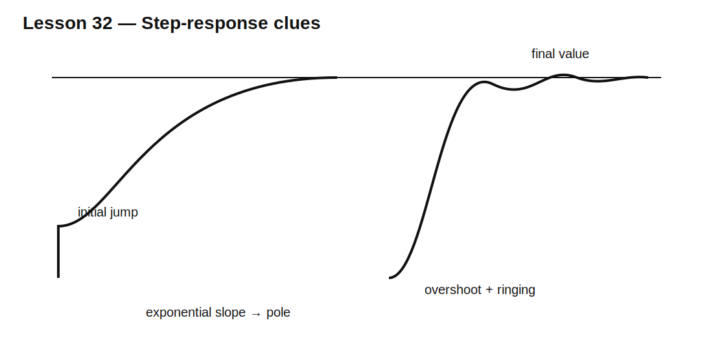

# Lesson 32 — Step Response as a Diagnostic Tool

> **Fast-track time:** 15–20 minutes  
> **Capability unlocked:** Infer hidden poles, ringing, loading, and parasitics from a measured transient.

## Why a step is useful

A step contains a wide range of frequencies. One transient can reveal:

- bandwidth;
- delay;
- damping;
- overshoot;
- multiple time constants;
- saturation or slew limits;
- measurement loading.

## Read the waveform in layers



### Immediate jump

An instantaneous-looking jump usually comes from a resistive divider, ESR, feedthrough capacitance, or direct path.

### Exponential approach

A single smooth exponential suggests one dominant real pole:

$$V(t)=V_F+(V_0-V_F)e^{-t/\tau}$$

Estimate the time constant from the 63.2% point or from the remaining-error ratio.

### Overshoot and ringing

Overshoot implies at least two energy-storage elements or an active feedback loop. Ringing period estimates resonance:

$$f_r\approx\frac{1}{T_r}$$

The decay envelope reveals damping.

### Fast edge plus slow tail

This usually indicates multiple modes: a small fast capacitor, a larger slow storage element, dielectric absorption, leakage, or a second RC stage.

## Useful measurements

- 10–90% rise time;
- peak overshoot;
- ringing frequency;
- time to 1% settling;
- final DC gain;
- initial slope;
- area under current or power.

## KiCad experiment

Compare four circuits driven by the same step:

1. one RC low-pass;
2. two cascaded RC stages;
3. underdamped RLC;
4. RC with capacitor ESR and leakage.

Use:

```spice
.tran 100n 20m startup
```

Measure:

```spice
.meas tran T10 WHEN V(OUT)=0.1 RISE=1
.meas tran T90 WHEN V(OUT)=0.9 RISE=1
.meas tran VPK MAX V(OUT)
```

## What to infer

- One clean exponential: one dominant pole.
- S-shaped response: multiple poles.
- Oscillation: complex poles or parasitic LC.
- Initial voltage step: ESR or direct resistive path.
- Final error: loading, leakage, or divider ratio.
- Slower measured edge than simulated: source impedance, probe capacitance, or bandwidth limit.

## Common mistakes

- Looking only at the first 90% and missing a slow tail.
- Treating all overshoot as simulator error.
- Estimating bandwidth from edge rate without including source and probe.
- Fitting one time constant to a multi-mode waveform.
- Ignoring the final DC value.

## Design challenge

A measured 1 V step response jumps immediately to 0.2 V, rises to 1.08 V, rings at 40 kHz, and settles to 0.95 V.

Identify at least four likely circuit properties and propose the minimum passive model that can reproduce them.

## Remember

> A step response is a compact fingerprint of current paths, energy storage, damping, loading, and measurement bandwidth.