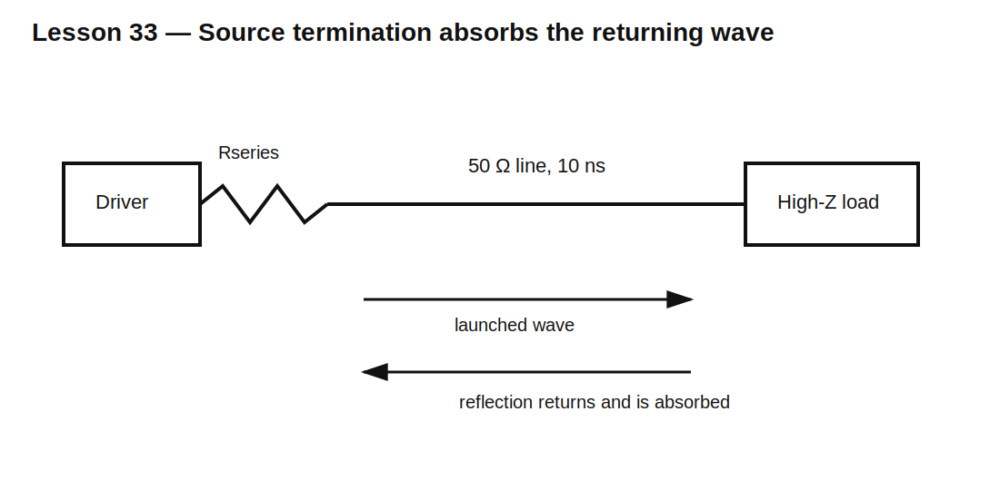

# Lesson 33 — Source, Load Impedance, and Termination

> **Fast-track time:** 15–20 minutes  
> **Capability unlocked:** Predict when a source, cable, trace, and load will distort or reflect a fast signal.

## The engineering problem

A source never drives an abstract node. It drives a physical interconnect and load. The observed voltage depends on:

- source resistance;
- interconnect impedance and delay;
- load resistance and capacitance;
- edge rise time;
- termination.

## Slow-signal view

For a resistive source $R_S$ and load $R_L$:

$$V_L=V_S\frac{R_L}{R_S+R_L}$$

A low-impedance source driving a high-impedance load preserves amplitude. A heavy load creates attenuation and extra current.

## Fast-signal view

When propagation delay is significant relative to edge rise time, the interconnect behaves as a transmission line with characteristic impedance $Z_0$.

The initial launched wave is approximately:

$$V^+=V_S\frac{Z_0}{R_S+Z_0}$$

At the load, reflection coefficient is:

$$\Gamma_L=\frac{R_L-Z_0}{R_L+Z_0}$$

- matched load: $\Gamma=0$;
- open load: $\Gamma\approx+1$;
- short load: $\Gamma=-1$.



## When to care

Transmission-line effects become important when interconnect delay is a meaningful fraction of rise time. Edge rate matters more than repetition frequency.

A 1 MHz clock with a 1 ns edge can require termination. A 100 MHz sine wave on a very short trace may not.

## Common termination methods

### Source series termination

Choose:

$$R_S+R_{series}\approx Z_0$$

Low DC loss at the receiver; works well for one point-to-point load.

### Parallel termination

Place $R_L\approx Z_0$ at the receiver. Excellent reflection control, but consumes DC current.

### Thevenin or AC termination

Used when DC power, bias, or signal coding makes direct parallel termination undesirable.

## KiCad/ngspice experiment

Model a 50 Ω line with 10 ns delay. Compare:

- ideal low-resistance source, open load;
- 50 Ω source termination;
- 50 Ω parallel load;
- 100 Ω load.

Use a transmission-line element and:

```spice
.tran 100p 100n startup
```

Plot source-end and load-end voltages.

## What to observe

- The load does not respond until propagation delay passes.
- An open load doubles the arriving wave temporarily.
- Reflections return to the source after another delay.
- Source termination can produce a half-amplitude launched wave that reaches full amplitude at an open receiver.
- Probe capacitance can itself disturb a high-speed line.

## Common mistakes

- Matching to load resistance while ignoring source resistance.
- Deciding from clock frequency instead of edge time.
- Adding a series resistor far from the driver.
- Parallel-terminating without checking DC power.
- Simulating a long fast trace as one ideal wire.

## Design challenge

A 3.3 V CMOS driver has 15 Ω output resistance and drives a 50 Ω, 20 ns point-to-point line into a high-impedance receiver.

Choose a source-series resistor, predict initial and final load voltages, and verify the reflection sequence.

## Remember

> A fast interconnect is part of the circuit. Match the source, line, and load so energy arrives once instead of bouncing back and forth.