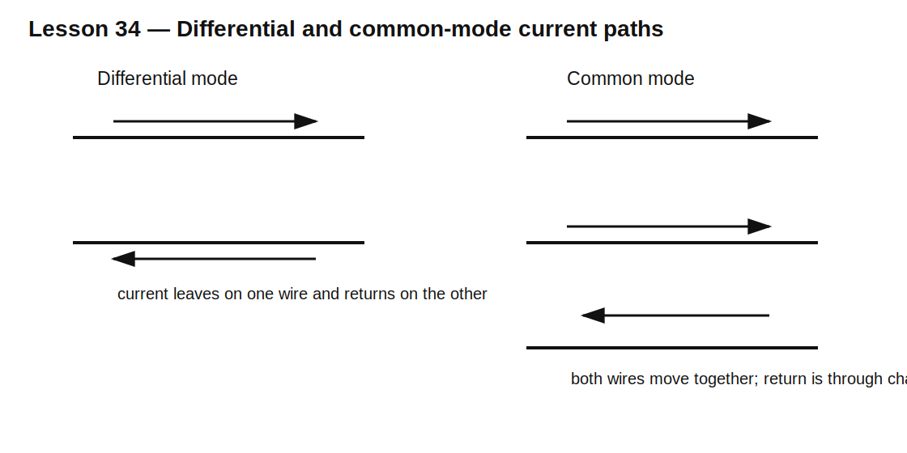

# Lesson 34 — Differential-Mode and Common-Mode Filtering

> **Fast-track time:** 15–20 minutes  
> **Capability unlocked:** Choose the correct passive filter topology for noise between conductors or noise shared by both conductors.

## The engineering problem

Noise on a cable can appear in two fundamentally different ways.

### Differential-mode noise

Current leaves on one conductor and returns on the other. The noise voltage exists between the conductors.

### Common-mode noise

Both conductors move together relative to chassis or earth. Return current flows through parasitic capacitance, shielding, or another unintended path.

A filter effective for one mode may do little for the other.



## Differential-mode filter

A series inductor and line-to-line capacitor form a low-pass path for the intended pair:

- series impedance blocks high-frequency differential current;
- X capacitor shunts differential noise between lines.

A simple LC corner estimate is:

$$f_0=\frac{1}{2\pi\sqrt{LC}}$$

Damping and source/load impedance determine whether the filter rings.

## Common-mode choke

A common-mode choke has two windings on one core.

- Differential currents are equal and opposite, so their flux largely cancels.
- Common-mode currents flow in the same magnetic sense, so inductance is high.

The choke therefore blocks common-mode noise while carrying normal differential current with relatively little impedance.

## Y capacitors

Capacitors from lines to chassis provide a high-frequency return path for common-mode current. Their value is constrained by:

- leakage current;
- safety class;
- working voltage;
- insulation requirements;
- applicable standards.

Do not substitute ordinary capacitors in safety-critical line-to-earth positions.

## KiCad simulation

Create a two-wire source and load. Run two cases:

1. differential excitation: +0.5 V on one wire and −0.5 V on the other;
2. common-mode excitation: +1 V on both wires relative to chassis.

Model:

- 100 µH common-mode inductance;
- 1 µH leakage/differential inductance;
- 10 nF line-to-line capacitor;
- 1 nF from each line to chassis.

Run:

```spice
.ac dec 100 100 100Meg
```

## What to observe

- The X capacitor strongly attenuates differential noise.
- The Y capacitors create a return path for common-mode noise.
- Common-mode choke leakage inductance also contributes differential filtering.
- Parasitic capacitance across the choke limits high-frequency attenuation.
- An undamped LC can amplify noise near resonance.

## Design workflow

1. Identify noise mode from measurement.
2. Identify source and return path.
3. Set attenuation target and frequency range.
4. Choose series impedance and shunt path for that mode.
5. Check resonance and damping.
6. Check current, saturation, leakage, and safety ratings.
7. Include cable, chassis, and parasitic capacitance.
8. Validate with correct common-mode and differential probes.

## Common mistakes

- Calling all cable noise “common mode.”
- Adding a common-mode choke to a differential-noise problem without checking leakage inductance.
- Ignoring filter resonance.
- Connecting ordinary capacitors to protective earth.
- Testing only with one-ended excitation.
- Forgetting that layout can bypass the filter capacitively.

## Design challenge

A 24 V cable carries 2 A DC and has noise at 2 MHz. Measurements show 80% common-mode and 20% differential-mode content.

Propose a filter topology, choose starting values, and define separate simulations and measurements for both modes.

## Remember

> Filter the actual current loop: differential noise returns through the pair; common-mode noise returns through chassis and parasitic paths.