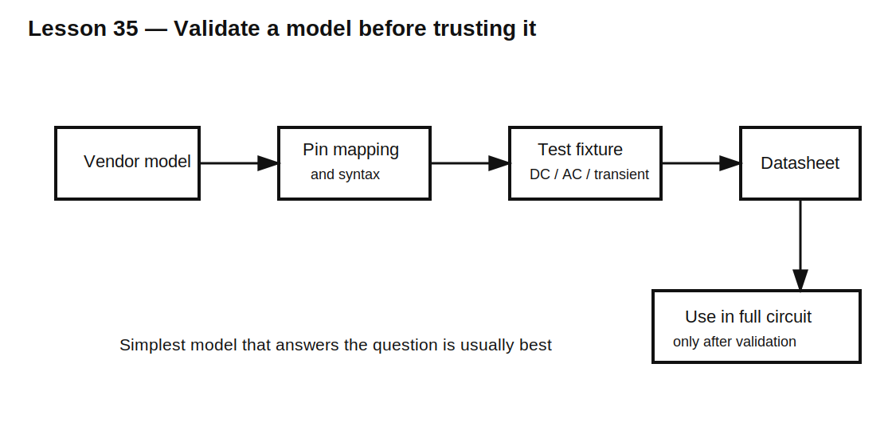

# Lesson 35 — Using Real Component Models Without Losing the Physics

> **Fast-track time:** 15–20 minutes  
> **Capability unlocked:** Import, validate, simplify, and debug vendor SPICE models.

## The engineering problem

Ideal R, L, C, diode, and transistor symbols are excellent for learning. Real design eventually needs models that include:

- parasitic resistance and inductance;
- nonlinear capacitance;
- saturation;
- leakage;
- temperature behavior;
- package effects.

A vendor model can improve accuracy, but it can also hide assumptions, fail to converge, or map pins incorrectly.

## Use the simplest model that answers the question

Start with levels:

1. ideal component;
2. ideal plus dominant parasitic;
3. behavioral model;
4. vendor subcircuit;
5. extracted interconnect or electromagnetic model.

Do not begin with the most complex model automatically.

## Subcircuit structure

A model commonly begins with:

```spice
.subckt PART pin1 pin2 pin3
...
.ends PART
```

The schematic symbol pin order must match the `.subckt` declaration exactly.



## KiCad workflow

1. Save the model file inside the project or a controlled model directory.
2. Associate the symbol with the model.
3. map symbol pins to subcircuit pins;
4. define model name and library path;
5. inspect the generated netlist;
6. test the model in a minimal circuit before using it in a large design.

If the model requires parameters, pass them deliberately rather than copying unexplained text.

## Create a model test fixture

For every imported model, verify basic behaviors:

- DC operating point;
- expected polarity;
- current direction;
- transient response;
- AC impedance if relevant;
- limits at high and low values;
- comparison with one datasheet curve.

A model that loads without error is not necessarily correct.

## Model portability problems

Vendor files may use simulator-specific syntax:

- unsupported behavioral functions;
- proprietary switches;
- encrypted sections;
- nested libraries;
- unusual temperature expressions;
- convergence options.

Read simulator warnings and simplify only when you understand what is being removed.

## Convergence aids

Sometimes small physical parasitics improve convergence:

- capacitor ESR;
- inductor DCR;
- switch on-resistance;
- tiny leakage path;
- finite source rise time.

These should represent plausible physics, not arbitrary values chosen only to silence the solver.

## Validation example

For a real capacitor model:

1. run an AC impedance sweep;
2. confirm low-frequency capacitive slope;
3. identify ESR minimum;
4. confirm self-resonant frequency;
5. verify high-frequency inductive slope;
6. compare against vendor impedance plot.

## Common mistakes

- Trusting model filename instead of checking the internal `.subckt` name.
- Mapping pins by symbol appearance rather than declaration order.
- Using a model outside its voltage, current, frequency, or temperature range.
- Adding huge shunt resistors or tiny series resistors without documenting them.
- Assuming simulation accuracy exceeds model accuracy.
- Using a complex model before understanding the ideal circuit.

## Design challenge

Take a vendor capacitor or inductor model and build a validation fixture.

Requirements:

- document subcircuit pin order;
- plot impedance magnitude from 100 Hz to 100 MHz;
- identify ESR and self-resonance;
- compare with the datasheet;
- create a simplified RLC equivalent and state where it stops matching.

## Remember

> A model is a claim about behavior. Validate that claim in a small fixture before trusting it in a large circuit.