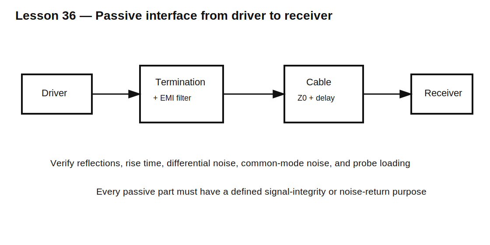

# Lesson 36 — Passive Interface Capstone: Cable, Filter, Termination, and Measurement

> **Fast-track time:** 20–30 minutes  
> **Capability unlocked:** Design and verify a robust passive interface from source to cable to receiver.

## Design brief

A controller sends a 0–3.3 V digital pulse over a 2 m cable to a high-impedance receiver. The cable runs beside a 24 V motor cable and must survive realistic noise and edge distortion.

The design must control:

- source and cable reflections;
- receiver loading;
- differential and common-mode noise;
- edge rate and settling;
- connector and trace parasitics;
- probe loading during validation.

## Requirements

- source output resistance: 18 Ω;
- cable characteristic impedance: 50 Ω;
- one-way cable delay: 10 ns;
- receiver input: 1 MΩ in parallel with 8 pF;
- receiver thresholds: 0.8 V low, 2.0 V high;
- signal rise time at receiver: 5–30 ns;
- settle within ±5% before 80 ns;
- induced common-mode burst: 10 V peak around 5 MHz;
- induced differential burst: 1 V peak around 5 MHz.



## Step 1 — Termination

For source termination:

$$R_{series}\approx Z_0-R_{driver}$$

$$R_{series}\approx50-18=32\ \Omega$$

Choose 33 Ω and place it at the driver.

The first launched wave is near half amplitude. At the high-impedance receiver, the reflection doubles it toward the full 3.3 V level. The source termination absorbs the returning reflection.

## Step 2 — Receiver capacitance

The 8 pF receiver and any probe capacitance create a load during the edge. Verify that the resulting rise time stays above 5 ns but below 30 ns.

A deliberately added capacitor may reduce EMI, but it also slows the edge and increases source current.

## Step 3 — Noise filtering

Differential and common-mode noise require different paths.

Candidate topology:

- source-series termination;
- common-mode choke near the connector;
- small line-to-line capacitor if differential filtering is needed;
- symmetric capacitance to chassis where safety and leakage permit;
- continuous return and shield strategy.

Do not choose component values before checking signal attenuation and resonance.

## Step 4 — Parasitics

Include:

- connector inductance;
- trace resistance and inductance;
- common-mode choke leakage inductance and winding capacitance;
- capacitor ESL;
- receiver and probe capacitance.

## Step 5 — Simulation plan

Run separate tests:

1. clean step and reflection timing;
2. receiver rise time and threshold crossing;
3. differential 5 MHz noise injection;
4. common-mode 5 MHz noise injection;
5. probe loading comparison;
6. component tolerance corners.

Use:

```spice
.tran 100p 300n startup
.ac dec 100 100k 100Meg
```

## Pass/fail measurements

- minimum and maximum receiver voltage;
- 10–90% rise time;
- first high-threshold crossing;
- time to remain within ±5%;
- common-mode and differential attenuation at 5 MHz;
- peak driver current;
- sensitivity to 8–15 pF receiver/probe capacitance.

## Hardware validation plan

- measure at the receiver with a low-capacitance differential probe;
- measure both conductors for common-mode analysis;
- use a fast edge from the real driver;
- compare with and without the source resistor;
- inject known noise through a controlled fixture;
- document cable, probe, and grounding setup.

## Common failure patterns

- using a low-pass filter that prevents the receiver from reaching threshold in time;
- placing the series terminator at the receiver;
- using a common-mode choke for a mainly differential problem;
- ignoring choke self-resonance;
- measuring with enough probe capacitance to “fix” the ringing;
- validating only the nominal cable and load.

## Deliverable

Submit:

- full interface schematic;
- termination calculation;
- noise-mode diagram;
- component values and ratings;
- time-domain and AC plots;
- tolerance table;
- probe-aware hardware test plan;
- explanation of every passive component.

## Remember

> A robust interface is a controlled energy path from driver through interconnect to receiver, with separate plans for signal integrity, noise return, and measurement.