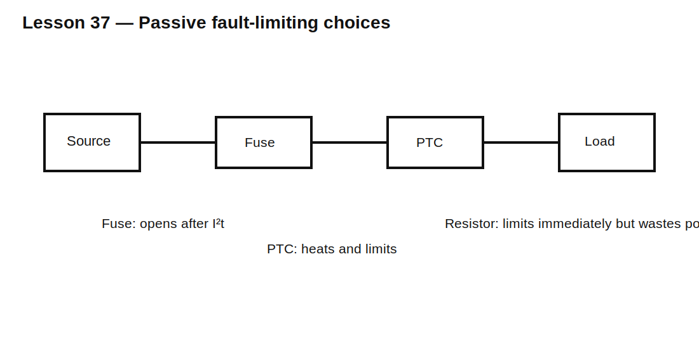

# Lesson 37 — Passive Fault Limiting: Fuses, PTCs, and Current-Limiting Resistors

> **Fast-track time:** 15–20 minutes  
> **Capability unlocked:** Choose a passive protection element from normal current, fault current, energy, and clearing time.

## The engineering problem

A circuit must work normally yet disconnect or limit current during a fault. Passive protection commonly uses:

- fuses;
- resettable PTCs;
- fusible resistors;
- fixed current-limiting resistors;
- surge suppressors used with upstream interruption.

The protection element must coordinate with the source, wiring, load, and downstream component limits.

## Fuse basics

A fuse does not open at one exact current. Clearing time depends on current magnitude and thermal history.

Datasheets provide time-current curves and often an $I^2t$ rating:

$$I^2t=\int i^2(t)\,dt$$

This approximates heating energy in the fuse element during a short event.

Two important values are:

- **pre-arcing $I^2t$** — energy before the element melts;
- **total clearing $I^2t$** — energy until current is interrupted.

## PTC resettable fuse

A polymer PTC heats under overcurrent, its resistance rises sharply, and current falls to a holding level.

Check:

- hold current at worst-case ambient;
- trip current;
- trip time;
- maximum voltage;
- fault current;
- post-trip leakage;
- resistance after repeated trips;
- cooldown and reset behavior.

A PTC limits current; it usually does not create a true open circuit.



## Current-limiting resistor

For a source voltage V and desired maximum current I:

$$R\ge\frac{V}{I}$$

But continuous loss is:

$$P=I^2R$$

A resistor may be excellent for charging, signal protection, or low-power faults, but inefficient for a high-current supply path.

## Coordination with downstream limits

The protection must act before downstream wiring, traces, connectors, semiconductors, or capacitors exceed their safe energy.

Compare:

- prospective fault current;
- clearing time;
- downstream $I^2t$ or thermal limit;
- interruption voltage and arc rating;
- source energy.

## KiCad/ngspice experiment

Model a 24 V source with 100 mΩ source resistance, a 2 Ω normal load, and a short-circuit switch at 10 ms.

Compare:

1. no limiter;
2. 1 Ω series resistor;
3. behavioral fuse opening when integrated $i^2$ reaches a threshold;
4. PTC modeled as resistance increasing with a thermal RC.

Use:

```spice
.tran 10u 500m startup
```

Plot source current, load voltage, limiter power, and accumulated $I^2t$.

## What to observe

- Source impedance strongly affects fault current.
- A resistor limits immediately but dissipates power continuously.
- A fuse allows a large current until it clears.
- A PTC response is temperature-dependent and leaves residual current.
- A protection part can survive while downstream copper does not.

## Design workflow

1. Define normal current including startup and surge.
2. Determine maximum source voltage and available fault current.
3. Define downstream current, energy, and temperature limits.
4. Choose protection type.
5. Check time-current or trip curves at temperature.
6. Check interruption voltage and fault-current rating.
7. Verify nuisance-trip margin.
8. Analyze repeated faults and restart behavior.
9. Test the real source and wiring.

## Common mistakes

- Choosing a fuse only from normal current.
- Ignoring startup inrush.
- Treating a PTC as a perfect open circuit.
- Using a fuse whose breaking capacity is below available fault current.
- Checking average current but not fault energy.
- Assuming simulation predicts physical fuse rupture accurately.

## Design challenge

Protect a 24 V circuit drawing 1.2 A normally and 2.5 A for 100 ms at startup. Available short-circuit current is 20 A. A downstream MOSFET path can tolerate 12 A²s.

Choose a protection strategy, define acceptable fuse/PTC curves, and prove the downstream energy limit is not exceeded.

## Remember

> Fault protection is a race between source energy, protection response, and downstream damage.