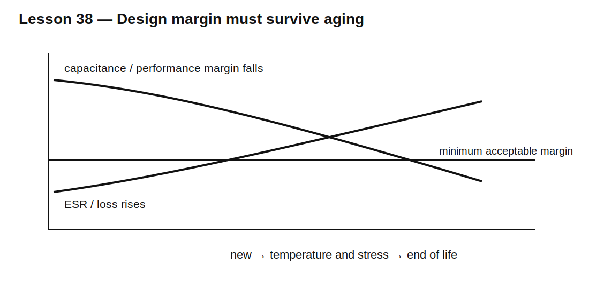

# Lesson 38 — Aging, Drift, and Reliability of Passive Components

> **Fast-track time:** 15–20 minutes  
> **Capability unlocked:** Design with components whose values and failure risk change over years, temperature, voltage, and stress.

## The engineering problem

A circuit that passes on day one can fail later because passive components age.

Important mechanisms include:

- electrolytic capacitor dry-out;
- ceramic capacitor aging and flex cracking;
- resistor drift from heat and overload;
- inductor insulation and core degradation;
- connector corrosion;
- solder-joint fatigue;
- repeated surge damage.

Reliability begins with identifying which parameters matter over life.

## Capacitor lifetime

Electrolytic capacitor life is strongly temperature-dependent. A common approximation is that life roughly doubles for each 10°C reduction in core temperature:

$$L_2\approx L_1\cdot2^{(T_1-T_2)/10}$$

This is only a rule of thumb; use the manufacturer’s model and ripple-current data.

Capacitor heating includes ESR loss:

$$P_{ESR}=I_{RMS}^2ESR$$

As ESR rises with age, heating can increase further.

## Ceramic capacitor aging

Class II dielectrics such as X7R and X5R can lose capacitance logarithmically with time after the last high-temperature reset. They also lose capacitance from DC bias and temperature.

Design with **minimum effective capacitance at end of life**, not nominal capacitance on the label.

## Resistor drift

Resistance changes with:

- initial tolerance;
- temperature coefficient;
- long-term load-life drift;
- humidity;
- pulse overload;
- voltage coefficient in some technologies.

For timing or gain ratios, matched networks may provide better tracking than unrelated discrete resistors.



## Derating

Derating reduces electrical and thermal stress to improve life and margin.

Typical checks include:

- voltage below maximum working voltage;
- power below rated power at actual ambient;
- ripple current below thermal limit;
- inductor current below saturation and thermal limits;
- surge energy below repetitive capability.

There is no universal safe percentage. Use product-specific guidance and system reliability goals.

## End-of-life simulation

Create parameter sets for:

- capacitor C reduced by 30%;
- ESR increased by 2×;
- resistor shifted by tolerance plus load-life drift;
- inductor DCR increased by temperature;
- supply at worst allowed limit.

Re-run the original pass/fail measurements.

## KiCad experiment

Take the load-step circuit from Lesson 13.

Compare:

1. new capacitor bank;
2. C reduced to 70%;
3. ESR doubled;
4. both changes together.

Use:

```spice
.param CAGE=1 ESRAGE=1
```

and scale component values.

## What to observe

- Reduced C increases sustained droop.
- Increased ESR enlarges the immediate voltage step.
- Higher DCR increases loss and changes RL response.
- A nominally generous design can lose all margin at end of life.
- Temperature accelerates several failure mechanisms simultaneously.

## Reliability workflow

1. Define service life and environment.
2. Identify life-limiting components.
3. Obtain aging, load-life, ripple, and derating data.
4. Calculate internal heating where possible.
5. simulate end-of-life values;
6. analyze open, short, and drift failure modes;
7. ensure protection contains failures;
8. plan accelerated and real-time testing.

## Common mistakes

- Applying initial tolerance as the only lifetime variation.
- Using ambient temperature instead of component hotspot temperature.
- Ignoring ESR growth.
- Assuming every capacitor technology ages the same way.
- Treating derating as a substitute for thermal analysis.
- Choosing components with no relevant lifetime data for a critical function.

## Design challenge

A 12 V rail uses a 1000 µF electrolytic capacitor with 80 mΩ initial ESR and 1 A RMS ripple. The circuit must operate for 10 years at elevated temperature.

Define an end-of-life model with capacitance loss and ESR growth, calculate initial ESR heating, and state the manufacturer data required to justify the lifetime.

## Remember

> Reliable design uses the component value and loss expected at the end of life, not only the value measured when the board is new.