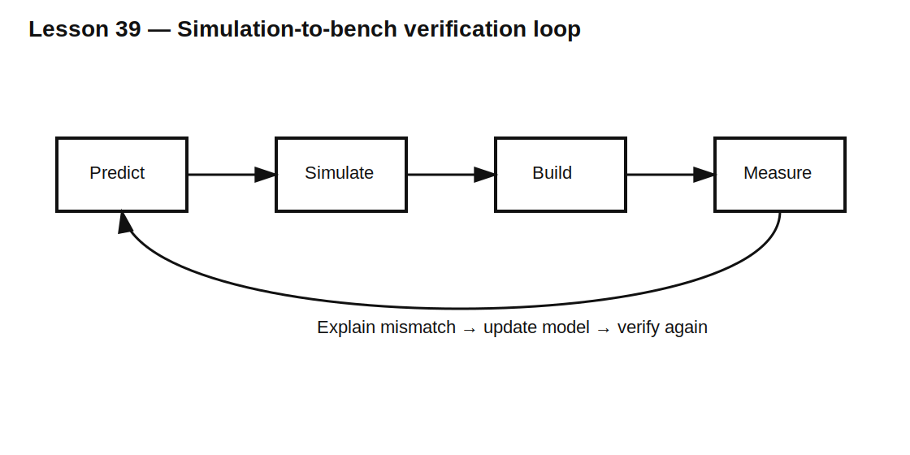

# Lesson 39 — From Simulation to Bench: A Verification Workflow

> **Fast-track time:** 15–20 minutes  
> **Capability unlocked:** Turn a SPICE result into a controlled hardware experiment with meaningful pass/fail evidence.

## The engineering problem

Simulation is valuable because it isolates variables. Hardware is valuable because it includes everything you forgot.

A good workflow uses both:

1. predict;
2. simulate;
3. build;
4. measure;
5. explain differences;
6. update the model;
7. verify again.

## Start with a measurable requirement

Weak requirement:

> The rail should look clean.

Strong requirement:

> The 3.3 V rail shall remain above 3.15 V during a 500 mA load step with 20 ns edge and recover to within 1% in 200 µs.

The strong version defines:

- stimulus;
- measurement point;
- limit;
- timing;
- pass/fail rule.

## Build a prediction table

Before measuring, record:

| Quantity | Hand estimate | Simulation | Hardware |
|---|---:|---:|---:|
| Initial ESR step | | | |
| Peak overshoot | | | |
| Ringing frequency | | | |
| Recovery time | | | |
| Energy or average power | | | |

This prevents adjusting the explanation after seeing the result.



## Design the test fixture

The fixture is part of the circuit. Include:

- source impedance;
- wiring and connector inductance;
- programmable or switched load;
- current-sense element;
- probe connection points;
- local decoupling;
- safe discharge path;
- repeatable trigger signal.

For fast transients, a MOSFET load step is often more repeatable than manually connecting a resistor.

## Measure the stimulus too

Do not measure only the output. Capture:

- source voltage;
- load current;
- control/trigger edge;
- output voltage;
- relevant switch-node voltage.

The circuit cannot be blamed for a different stimulus than the simulation used.

## Compare in layers

When hardware differs from simulation, check:

1. component values and model pin mapping;
2. initial conditions;
3. source and load waveform;
4. probe loading and grounding;
5. trace and wiring inductance;
6. ESR, ESL, leakage, and temperature;
7. device nonlinearities;
8. simulator timestep and convergence settings.

Change one assumption at a time.

## KiCad exercise

Use the Lesson 13 rail-step circuit.

Create three models:

- ideal schematic;
- parasitic-aware simulation;
- measurement-aware simulation including probe capacitance and ground inductance.

For each model, generate the same `.meas` values:

```spice
.meas tran VMIN MIN V(RAIL)
.meas tran TREC WHEN V(RAIL)=3.267 RISE=1
```

## What good evidence looks like

A complete result includes:

- schematic revision;
- BOM values and tolerances;
- simulator and model versions;
- exact directive;
- measurement setup photograph or diagram;
- probe type and bandwidth;
- source/load conditions;
- waveform and numerical measurements;
- explanation of remaining mismatch.

## Common mistakes

- Measuring at a convenient point instead of the specified node.
- Comparing different load edges.
- Using oscilloscope cursors for a noisy requirement without a defined algorithm.
- Changing several model values until the plot matches.
- Ignoring fixture resistance and inductance.
- Reporting only the best unit or best run.

## Design challenge

Write a verification plan for a 12 V relay driver with a flyback clamp.

Prove:

- peak MOSFET VDS below 50 V;
- relay current below 10 mA within 8 ms;
- clamp energy below its repetitive rating;
- results at minimum and maximum coil resistance;
- probe method does not materially change the waveform.

## Remember

> Verification is not “the plots look similar.” It is a controlled comparison of the same stimulus, node, metric, and limit.