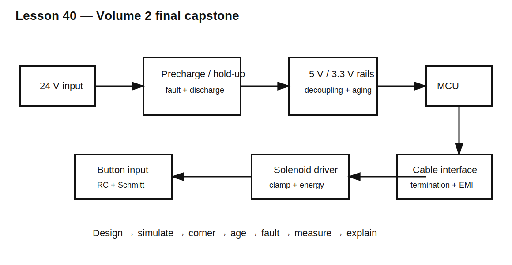

# Lesson 40 — Volume 2 Final Capstone: Design, Protect, and Verify a Real Controller Interface

> **Fast-track time:** 30–45 minutes  
> **Capability unlocked:** Integrate passive components, transient analysis, protection, layout parasitics, tolerance, aging, and bench verification into one complete design.

## Design brief

Design the passive support circuitry for a 24 V industrial controller with:

- a 5 V buck-regulator output;
- a 3.3 V MCU rail;
- a 2 m external digital cable;
- a pushbutton input;
- a 24 V solenoid driven by a MOSFET;
- input bulk capacitance;
- required ride-through during brief source interruption;
- safe discharge after shutdown.

The goal is not one perfect schematic. The goal is a defensible engineering process.

## System requirements

### 24 V input and bulk capacitor

- input range: 20–30 V;
- input capacitor: choose value and technology;
- initial source current below 3 A;
- hold 15 W load above 18 V for 20 ms;
- discharge below 5 V within 10 s;
- available short-circuit current: 25 A.

### 5 V rail

- load step: 1.5 A;
- edge: 25 ns;
- regulator response delay: 50 µs;
- maximum droop: 180 mV;
- remote bulk path inductance: 3 nH;
- end-of-life capacitance: 70% nominal;
- end-of-life ESR: 2× initial.

### Digital cable

- driver resistance: 20 Ω;
- cable: 50 Ω, 10 ns one-way delay;
- receiver: 1 MΩ || 10 pF;
- receiver high threshold: 2.0 V;
- induced noise: 5 MHz common mode plus smaller differential component;
- settle within ±5% by 80 ns.

### Button

- bounce up to 4 ms;
- one clean transition within 30 ms;
- Schmitt thresholds: 2.0 V rising, 1.0 V falling.

### Solenoid

- R = 30 Ω ±15%;
- L = 150 mH;
- supply = 24 V;
- MOSFET VDS target below 60 V;
- current below 50 mA within 10 ms after turn-off;
- 10 operations per second maximum.

## Architecture

Separate the system into energy and signal domains:

1. input charging, hold-up, fault limiting, and discharge;
2. rail transient current delivery;
3. button timing and hysteresis;
4. cable signal integrity and EMI filtering;
5. solenoid magnetic-energy release;
6. measurement and verification.

## Required calculations

### Input energy

Use constant-power hold-up:

$$C\ge\frac{2Pt}{\eta(V_{start}^2-V_{min}^2)}$$

Then check inrush, precharge-resistor energy, bypass surge, and bleeder power.

### Rail decoupling

Allocate droop among:

$$\Delta V\approx I\cdot ESR+L\frac{di}{dt}+\frac{I\Delta t}{C}$$

Use end-of-life C and ESR, not new nominal values.

### Cable termination

Start with:

$$R_{series}\approx Z_0-R_{driver}$$

Then include receiver and probe capacitance, cable delay, and filter parasitics.

### Button timing

Calculate threshold crossing rather than quoting RC:

$$t=-RC\ln\left(1-\frac{V_T}{V_S}\right)$$

Verify both tolerance corners and bounce waveforms.

### Solenoid clamp

Calculate:

$$I_0=\frac{V}{R}$$

$$E_L=\frac12LI_0^2$$

Choose a clamp from current-decay and switch-voltage requirements, then verify repetitive energy and worst-case coil resistance.

## Required simulation set

Create separate, reviewable simulations for:

1. input precharge and bypass;
2. constant-power ride-through;
3. safe discharge;
4. 5 V rail load step at new and end-of-life conditions;
5. button bounce and Schmitt thresholds;
6. cable reflections and receiver settling;
7. common-mode and differential noise injection;
8. solenoid turn-off and clamp energy;
9. fuse/PTC or fault-limiting behavior;
10. probe-loading sensitivity.

Every simulation must include at least one objective `.meas` result.

## Required corner table

Include:

- minimum and maximum input voltage;
- component tolerance;
- capacitor bias and aging;
- ESR growth;
- minimum and maximum solenoid resistance;
- receiver capacitance plus probe;
- hot and cold protection behavior;
- startup, restart, normal operation, fault, and shutdown.

## Required bench plan

For each subsystem, define:

- stimulus source;
- trigger;
- measurement point;
- probe type;
- expected waveform;
- pass/fail metric;
- safety precautions;
- model parameter to update if hardware differs.

## Final design-review questions

A reviewer should be able to answer:

- Where does every stored joule go?
- Which component supplies current during each time interval?
- Which threshold determines each timing event?
- Which parasitic dominates the fastest transition?
- Which component reaches its voltage, current, power, thermal, or energy limit first?
- Which result changes most at end of life?
- What happens under one open or short passive-component failure?
- Can the proposed measurement distinguish the real waveform from probe artifacts?

## Completion criteria

Volume 2 is complete when the design package contains:

- readable schematic and block diagram;
- calculations with assumptions;
- KiCad simulations and reference netlists;
- component-rating and tolerance table;
- failure-mode review;
- end-of-life analysis;
- bench-verification plan;
- explanation of every passive component's function.

## Remember

> Competence is not memorizing capacitor and resistor values. It is predicting current, charge, energy, timing, parasitics, stress, aging, and measurement well enough to build a circuit that works outside the simulator.