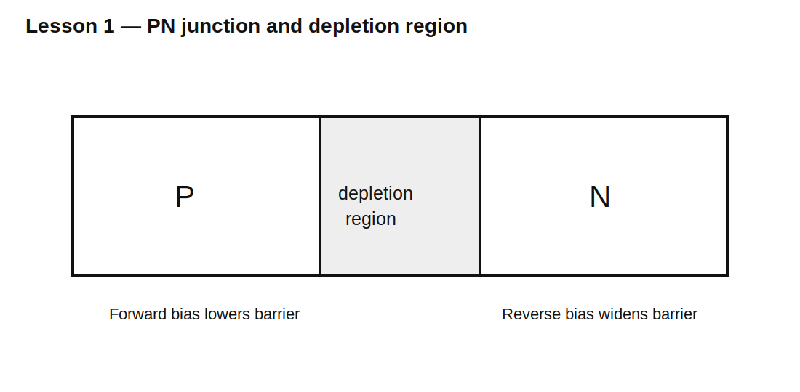

# Lesson 1 — Semiconductor Junction Intuition

> **Fast-track time:** 15–20 minutes  
> **Capability unlocked:** Explain why a PN junction conducts strongly in one direction and weakly in the other.

## The core idea

A semiconductor is neither a perfect conductor nor a perfect insulator. Its conductivity can be controlled by material doping, electric field, temperature, and injected charge.

- **N-type** material has electrons as majority carriers.
- **P-type** material has holes as majority carriers.

When P-type and N-type regions touch, carriers diffuse across the boundary and recombine. This leaves behind fixed ionized atoms, creating a region depleted of mobile charge.

That region is the **depletion region**.



## Built-in electric field

The uncovered fixed charges create an electric field that opposes further diffusion. Equilibrium is reached when diffusion and electric-field drift balance.

The junction therefore behaves like an energy barrier.

## Forward bias

Forward bias lowers the barrier.

- P side is made more positive than N side.
- carriers are injected across the junction;
- current rises rapidly and nonlinearly.

## Reverse bias

Reverse bias increases the barrier.

- depletion width grows;
- only a small leakage current flows;
- at sufficiently high reverse voltage, breakdown occurs.

## Why the diode is not a one-way wire

A real diode has:

- nonlinear forward voltage;
- leakage in reverse bias;
- junction capacitance;
- stored charge;
- reverse-recovery behavior;
- temperature dependence;
- finite series resistance;
- breakdown limits.

## First mathematical model

The Shockley relation is:

$$I_D=I_S\left(e^{V_D/(nV_T)}-1\right)$$

where:

- $I_S$ is saturation current;
- $n$ is ideality factor;
- $V_T=kT/q$ is thermal voltage;
- at room temperature, $V_T\approx25.9\text{ mV}$.

You do not need to memorize the semiconductor physics derivation yet. The key engineering result is that a small increase in forward voltage can create a large increase in current.

## KiCad simulation

Use a diode model and sweep voltage from −5 V to +1 V:

```spice
.dc V1 -5 1 1m
```

Plot diode current on both linear and logarithmic scales.

## What to observe

- Current is nearly zero over a large reverse-voltage range.
- Forward current rises exponentially before series resistance dominates.
- There is no single exact “turn-on voltage.”
- Temperature changes the curve.
- Breakdown is absent unless the model includes it.

## Practical mental model

Use three layers:

1. **Ideal diode:** open in reverse, short in forward.
2. **Constant-drop diode:** approximately 0.6–0.8 V when conducting.
3. **Real diode model:** exponential law plus resistance, capacitance, leakage, and recovery.

Choose the simplest layer that answers the design question.

## Common mistakes

- Saying a silicon diode always drops exactly 0.7 V.
- Assuming zero reverse current.
- Ignoring temperature.
- Treating breakdown as harmless.
- Using the ideal model for fast switching or precision biasing.

## Design challenge

A diode carries 1 mA at 0.60 V. Assume ideality factor 2 and room temperature.

Estimate the voltage increase required to raise current by 10×, ignoring series resistance. Then explain why the real result eventually deviates.

## Remember

> A PN junction is a controllable energy barrier. Forward bias lowers it; reverse bias raises it.