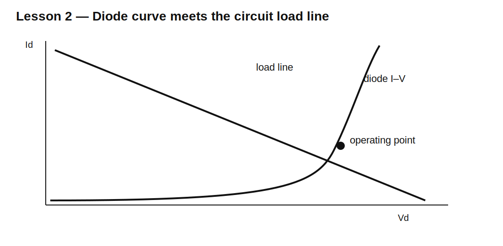

# Lesson 2 — Diode I–V Curves and Load-Line Design

> **Fast-track time:** 15–20 minutes  
> **Capability unlocked:** Find a diode operating point from the source, resistor, and nonlinear diode curve.

## The engineering problem

A diode does not independently choose “0.7 V.” Its voltage and current are determined by the rest of the circuit.

For a source V, series resistor R, and diode:

$$I=\frac{V_S-V_D}{R}$$

This straight-line relationship is the **load line**. The diode curve and load line intersect at the actual operating point.



## Example

A 5 V source drives a silicon diode through 1 kΩ.

If $V_D=0.7$ V:

$$I\approx\frac{5-0.7}{1000}=4.3\text{ mA}$$

But if the model predicts 0.62 V at this current:

$$I\approx4.38\text{ mA}$$

The resistor stabilizes current because a change in diode voltage changes the voltage left across R.

## Dynamic resistance

Near one operating point, the diode can be approximated by a small-signal resistance:

$$r_d\approx\frac{nV_T}{I_D}$$

At 1 mA with $n=2$:

$$r_d\approx\frac{2\cdot25.9\text{ mV}}{1\text{ mA}}\approx51.8\ \Omega$$

This is not the same as the DC ratio $V_D/I_D$.

## Why the resistor matters

Connecting a diode directly across an ideal voltage source is dangerous in both simulation and hardware.

- The diode current rises exponentially.
- Real current is limited only by source, wiring, package, and internal resistance.
- Ideal simulation models may produce enormous or unstable current.

Always identify the current-limiting path.

## KiCad simulation

Use:

- V1 = 0–5 V DC sweep;
- R1 = 100 Ω, 1 kΩ, and 10 kΩ;
- silicon diode model.

```spice
.dc V1 0 5 10m
```

Plot diode voltage, diode current, and resistor current.

Then run an operating-point analysis at 5 V.

## What to observe

- Lower R moves the operating point to higher current.
- Diode voltage changes much less than current.
- At high current, series resistance makes the curve more linear.
- Different diode models produce different operating points.
- A constant 0.7 V approximation can be useful but is not universal.

## Design workflow

1. Define supply range.
2. Define desired diode current.
3. Estimate diode forward voltage from a datasheet curve.
4. Calculate series resistance.
5. choose a standard value;
6. verify current and resistor power at voltage and temperature corners;
7. simulate with a real model.

## Common mistakes

- Solving current with 0.7 V and never checking a datasheet.
- Confusing dynamic resistance with $V/I$.
- Forgetting source resistance.
- Ignoring resistor power.
- Assuming two diodes at the same voltage share current equally.

## Design challenge

Design a resistor for a diode current of 5 mA from a 9 V supply varying from 8–10 V. The diode forward voltage may range from 0.55–0.80 V.

Choose an E24 resistor and calculate minimum and maximum current and resistor power.

## Remember

> The circuit sets the diode operating point. The diode curve alone does not determine current.