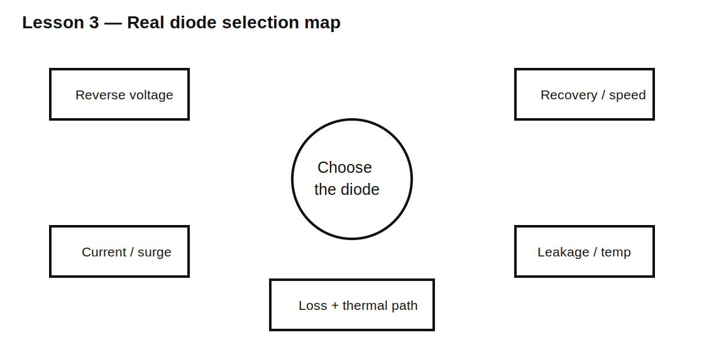

# Lesson 3 — Real Diode Selection: Voltage, Current, Speed, and Temperature

> **Fast-track time:** 15–20 minutes  
> **Capability unlocked:** Choose a diode from the actual electrical and thermal stresses rather than from the label “silicon diode.”

## The selection problem

A diode must satisfy several limits simultaneously:

- repetitive reverse voltage;
- average forward current;
- peak and surge current;
- forward-voltage loss;
- reverse leakage;
- reverse-recovery charge or time;
- junction capacitance;
- temperature and thermal resistance;
- package power dissipation.



## Forward loss

Approximate conduction loss:

$$P_F\approx V_F I_{AVG}$$

For pulsed current, use the actual waveform or integrate:

$$P_{AVG}=\frac{1}{T}\int_0^T v_D(t)i_D(t)dt$$

A diode with lower forward voltage may have greater leakage or capacitance.

## Reverse voltage

Use margin above the worst steady and transient reverse voltage. Include:

- source tolerance;
- transformer regulation;
- ringing and overshoot;
- startup and fault conditions.

## Reverse recovery

A conducting PN diode stores charge. When voltage reverses, reverse current flows briefly while that charge is removed.

This can cause:

- switching loss;
- current spikes;
- EMI;
- MOSFET stress;
- ringing.

Schottky diodes have little minority-carrier recovery, but can have higher leakage and lower voltage ratings.

## Junction capacitance

Even when reverse-biased, the diode acts partly like a capacitor. This matters in:

- high-speed clamps;
- RF detectors;
- signal paths;
- switch nodes.

## Temperature

As temperature rises:

- silicon forward voltage generally decreases at a given current;
- leakage generally increases strongly;
- thermal margin falls;
- Schottky leakage can become especially significant.

## KiCad experiment

Compare generic silicon and Schottky models in:

1. a 1 A DC conduction test;
2. a 100 kHz switching test;
3. a reverse-leakage temperature sweep;
4. a small-signal capacitance-sensitive node.

Use:

```spice
.tran 20n 50u startup
.temp 25 75 125
```

## What to observe

- Schottky forward drop is often lower.
- Leakage rises with temperature.
- Recovery current depends strongly on model detail.
- A simplistic diode model may omit realistic recovery.
- Package thermal limits can dominate before current rating.

## Design workflow

1. Draw the worst current and voltage waveforms.
2. Calculate average, RMS, peak, and surge values.
3. estimate conduction and switching loss;
4. choose voltage and current margin;
5. check temperature and package thermal path;
6. verify recovery and capacitance for the switching frequency;
7. simulate with a validated model;
8. verify on the bench.

## Common mistakes

- Selecting only from average current.
- Treating reverse-voltage rating as a normal operating target.
- Ignoring leakage at high temperature.
- Assuming all Schottky diodes are “fast enough” and otherwise equivalent.
- Trusting a model that contains no reverse-recovery behavior.

## Design challenge

Choose a diode type for a 12 V, 1 A buck-converter freewheel path at 200 kHz. Peak reverse voltage is 24 V including ringing, ambient is 70°C, and efficiency matters.

State the required datasheet parameters and compare silicon PN, fast-recovery, and Schottky options.

## Remember

> Diode selection is a loss, stress, speed, leakage, and thermal tradeoff—not simply a voltage-and-current lookup.