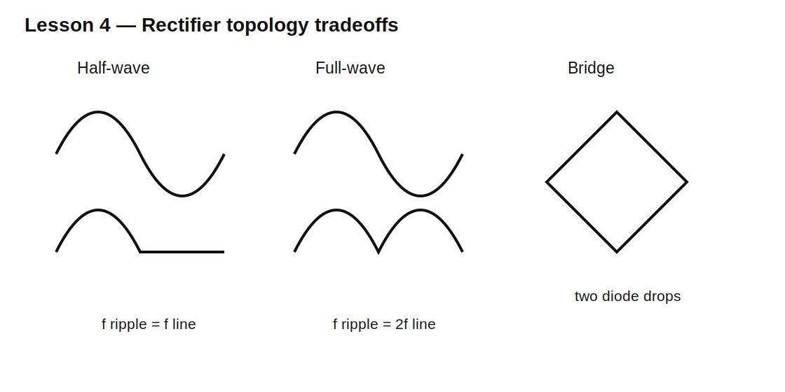

# Lesson 4 — Half-Wave, Full-Wave, and Bridge Rectifiers

> **Fast-track time:** 15–20 minutes  
> **Capability unlocked:** Choose a rectifier topology and predict output polarity, diode stress, frequency, and loss.

## Half-wave rectifier

One diode passes one half-cycle and blocks the other.

For a sinusoidal source with peak $V_P$ and diode drop $V_F$:

$$V_{OUT,PK}\approx V_P-V_F$$

Without a smoothing capacitor, the output contains one pulse per input cycle.

## Full-wave center-tapped rectifier

Two diodes use alternate halves of a center-tapped winding.

- one diode conducts per half-cycle;
- ripple frequency is twice line frequency;
- each diode can see high peak inverse voltage;
- the transformer winding is not fully used at one instant.

## Bridge rectifier

Four diodes provide full-wave rectification without a center tap.

- two diodes conduct in series each half-cycle;
- output polarity remains constant;
- ripple frequency is twice input frequency;
- diode loss includes approximately two forward drops.



## RMS versus peak voltage

For a sine wave:

$$V_P=\sqrt{2}V_{RMS}$$

A 12 V RMS transformer produces about 17 V peak before diode drop, regulation, and loading. This is why a “12 V AC” source can charge a capacitor well above 12 V.

## Diode current is not equal to load current

With a smoothing capacitor, diodes conduct in short pulses near the AC peaks. Peak and RMS diode currents can be much higher than average load current.

This affects:

- diode heating;
- transformer copper loss;
- fuse selection;
- EMI;
- capacitor ripple current.

## KiCad simulation

Compare half-wave and bridge rectifiers using:

- 12 V RMS, 60 Hz source;
- 100 Ω load;
- no capacitor initially.

```spice
.tran 20u 100m startup
```

Plot source voltage, load voltage, each diode current, and input current.

## What to observe

- Half-wave output pulses at 60 Hz.
- Full-wave output pulses at 120 Hz.
- Bridge output loses two diode drops.
- Diode reverse voltage depends on topology.
- Current direction through the load remains constant in full-wave circuits.

## Design workflow

1. Convert RMS source voltage to peak.
2. subtract conducting diode drops;
3. define load current;
4. identify ripple frequency;
5. calculate reverse-voltage stress;
6. check average, RMS, and surge current;
7. include source resistance and transformer regulation;
8. add smoothing only after the unsmoothed topology is understood.

## Common mistakes

- Treating RMS voltage as peak voltage.
- Forgetting two diode drops in a bridge.
- Selecting diodes only from load average current.
- Ignoring transformer and wiring resistance.
- Grounding the wrong bridge node in a simulation.

## Design challenge

Design a rectifier for a 9 V RMS, 50 Hz transformer feeding a 200 mA load.

Compare bridge and center-tapped options for output peak, ripple frequency, diode reverse-voltage requirement, transformer use, and conduction loss.

## Remember

> Rectifier topology determines how many half-cycles are used, how many diode drops are paid, and which devices carry and block current.