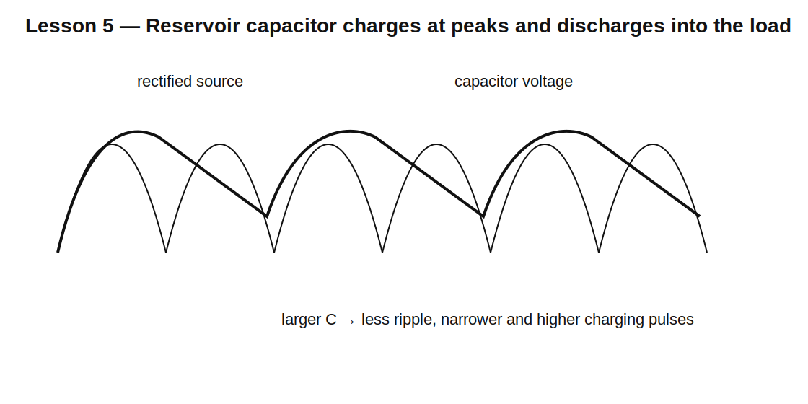

# Lesson 5 — Reservoir Capacitors, Ripple, and Rectifier Current Pulses

> **Fast-track time:** 15–20 minutes  
> **Capability unlocked:** Size a smoothing capacitor and predict ripple, diode conduction angle, inrush, and ripple-current stress.

## The basic action

A reservoir capacitor charges near the rectified waveform peak and supplies the load while the source voltage falls below the capacitor voltage.

Approximate ripple for a nearly constant load current:

$$\Delta V\approx\frac{I_{LOAD}}{f_{ripple}C}$$

where:

- half-wave: $f_{ripple}=f_{line}$;
- full-wave: $f_{ripple}=2f_{line}$.



## Example

A full-wave 60 Hz rectifier supplies 200 mA with 1000 µF.

$$\Delta V\approx\frac{0.2}{120\cdot1000\ \mu F}\approx1.67\text{ V}$$

This is a first estimate. Real ripple depends on diode drop, source resistance, transformer regulation, load behavior, and the short charging interval.

## Why diode current becomes pulsed

The diode conducts only when:

$$V_{source,rectified}>V_C+V_F$$

As C becomes larger, voltage ripple decreases, but charging occurs in narrower, higher-current pulses near each peak.

Consequences:

- higher diode peak current;
- higher transformer RMS current;
- increased EMI;
- capacitor ripple-current heating;
- larger startup inrush.

## Capacitor ripple current

The capacitor current is the difference between rectifier current and load current.

Check:

- RMS ripple-current rating;
- ESR heating;
- temperature and lifetime;
- voltage rating at high line and light load;
- inrush and surge current.

## KiCad simulation

Use a bridge rectifier with:

- 12 V RMS, 60 Hz source;
- source resistance 1 Ω;
- 100 Ω load;
- C = 100 µF, 1000 µF, and 4700 µF.

```spice
.tran 20u 500m startup
```

Measure:

```spice
.meas tran VMAX MAX V(OUT) FROM=300m TO=500m
.meas tran VMIN MIN V(OUT) FROM=300m TO=500m
.meas tran IDPK MAX I(D1) FROM=300m TO=500m
```

## What to observe

- Larger C reduces voltage ripple.
- Larger C increases startup and charging pulses.
- Source resistance strongly limits current peaks.
- Light load raises average output closer to the AC peak.
- Diode conduction occupies only a small part of each cycle.

## Design workflow

1. Calculate source peak from RMS.
2. subtract rectifier drops;
3. define minimum acceptable output voltage;
4. estimate C from load current and ripple frequency;
5. simulate with source resistance;
6. check diode peak/RMS current;
7. check capacitor ripple current and lifetime;
8. verify inrush and high-line voltage.

## Common mistakes

- Increasing capacitance without checking diode and transformer current.
- Using the ripple equation as an exact result.
- Ignoring capacitor tolerance and ESR.
- Selecting voltage rating from nominal output only.
- Forgetting light-load output is highest.
- Assuming average load current equals transformer RMS current.

## Design challenge

Design a bridge rectifier and reservoir capacitor for a 12 V RMS, 60 Hz source and 300 mA load.

Requirements:

- ripple below 1.0 V peak-to-peak;
- source resistance 1.5 Ω;
- capacitor tolerance −20%;
- diode peak current below 5 A;
- choose capacitor voltage and ripple-current ratings.

## Remember

> A reservoir capacitor trades voltage ripple for narrow current pulses, inrush, heating, and component stress.