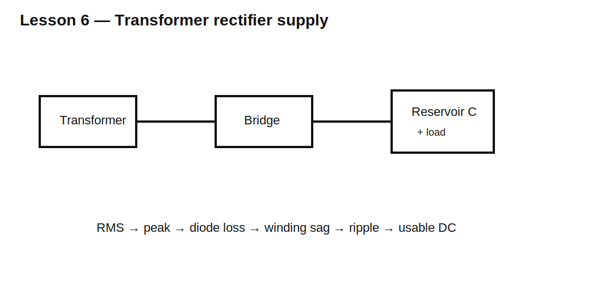

# Lesson 6 — Transformer Rectifier Supplies and Regulation

> **Fast-track time:** 15–20 minutes  
> **Capability unlocked:** Predict loaded DC output from transformer RMS voltage, winding resistance, rectifier loss, and reservoir ripple.

## The engineering problem

A transformer label gives RMS voltage at a stated load, not the final DC output. The capacitor charges near the AC peak:

$$V_{PK}=\sqrt2V_{RMS}$$

For a bridge:

$$V_{DC,near\ peak}\approx\sqrt2V_{RMS}-2V_F$$

But real output also depends on transformer regulation, winding resistance, diode pulses, line tolerance, and load ripple.



## Transformer regulation

A secondary may measure higher than rated at no load and sag at full load. Approximate regulation is:

$$Regulation=\frac{V_{NL}-V_{FL}}{V_{FL}}\times100\%$$

This means light-load voltage sets capacitor voltage stress, while heavy-load voltage sets minimum usable output.

## Source impedance matters

Winding resistance and leakage inductance limit charging pulses. They also cause:

- voltage sag;
- heating;
- wider conduction angle;
- lower peak diode current;
- poorer regulation.

## KiCad experiment

Model a 12 V RMS secondary using a 16.97 V peak sine source, 1.5 Ω winding resistance, bridge rectifier, 2200 µF capacitor, and 100 Ω then 20 Ω load.

```spice
.tran 20u 500m startup
```

Measure minimum and maximum output after startup.

## What to observe

- Light-load output approaches peak minus diode drops.
- Heavy load increases ripple and average sag.
- Winding resistance lowers peak current but also lowers DC output.
- A transformer rated “12 V” can produce more than 16 V DC at light load.

## Design workflow

1. Convert secondary RMS to peak at high line and no load.
2. calculate rectifier drops;
3. include winding resistance and regulation;
4. estimate ripple at full load;
5. verify minimum regulator headroom;
6. verify capacitor voltage at light load;
7. check transformer RMS current and heating.

## Common mistakes

- Treating transformer RMS voltage as DC output.
- Using full-load voltage to select capacitor voltage rating.
- Ignoring the pulsed secondary current waveform.
- Assuming the transformer current rating equals DC load current.

## Design challenge

A 15 V RMS transformer has 12% no-load regulation and feeds a bridge, 3300 µF capacitor, and 0.5 A load at 60 Hz.

Estimate high-line no-load capacitor voltage and full-load minimum voltage. State what additional transformer data is needed for confidence.