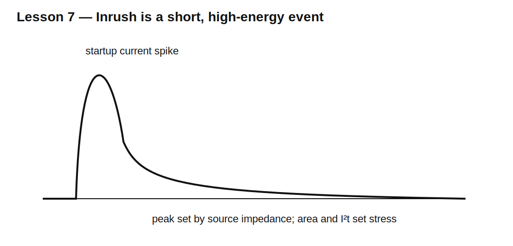

# Lesson 7 — Rectifier Inrush, Surge, and Source Impedance

> **Fast-track time:** 15–20 minutes  
> **Capability unlocked:** Predict startup current and choose rectifier, fuse, transformer, and limiter ratings.

## Why startup is different

At power-on, a discharged reservoir capacitor looks nearly like a short circuit. Initial current is limited by:

- transformer winding resistance;
- line and wiring resistance;
- diode resistance;
- capacitor ESR;
- NTC or intentional limiter;
- source phase at connection.

Worst-case turn-on can occur near the AC voltage peak.

$$I_{initial}\approx\frac{V_{PK}}{R_{total}}$$



## Energy view

The capacitor stores:

$$E_C=\frac12CV^2$$

That energy must pass through the rectifier and source path during startup. Peak current can be brief, but diode surge rating and fuse $I^2t$ still matter.

## NTC limiter

An NTC starts with higher cold resistance and heats to lower resistance.

Check:

- cold resistance at ambient;
- steady-state loss;
- maximum current;
- energy rating;
- hot-restart behavior;
- cooldown time.

## KiCad experiment

Use a bridge, 4700 µF capacitor, 12 V RMS source, and total source resistance values of 0.2 Ω, 1 Ω, and 3 Ω.

Start the source at zero crossing and near peak using source phase.

```spice
.tran 10u 200m startup
```

Measure peak diode current and source $I^2t$.

## What to observe

- Lower source resistance creates much larger peaks.
- Turn-on phase changes worst-case current.
- Larger C raises startup energy and often peak current.
- An NTC may fail to limit a rapid restart because it remains hot.

## Design workflow

1. Find maximum AC peak at high line.
2. estimate minimum source-path resistance;
3. simulate worst turn-on phase;
4. calculate capacitor energy;
5. check diode surge current and pulse duration;
6. coordinate fuse $I^2t$;
7. evaluate NTC or precharge;
8. verify hot restart.

## Common mistakes

- Using steady-state diode current to judge startup survival.
- Ignoring turn-on phase.
- Modeling an ideal source with zero resistance.
- Assuming an NTC always resets instantly.

## Design challenge

A 24 V RMS source charges 6800 µF through a bridge. Minimum total source resistance is 0.8 Ω.

Estimate worst initial current and stored energy. Propose an inrush-limiting strategy that keeps peak current below 20 A.