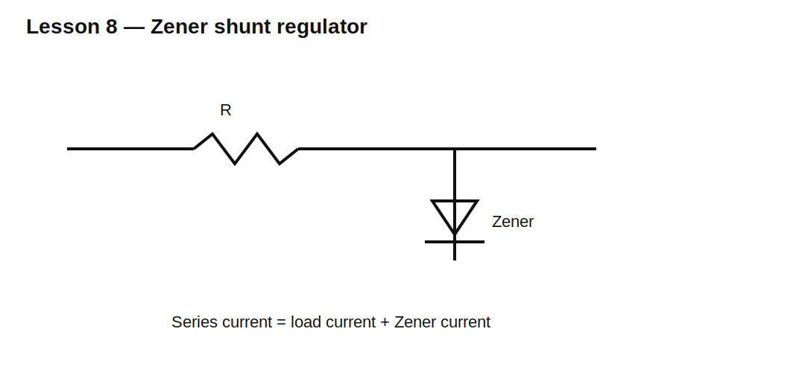

# Lesson 8 — Zener-Diode Behavior and Shunt Regulation

> **Fast-track time:** 15–20 minutes  
> **Capability unlocked:** Use reverse breakdown intentionally to create a simple voltage clamp or reference.

## The core behavior

A Zener diode is designed to operate in reverse breakdown. Below breakdown, current is small. Near the rated voltage, reverse current rises sharply.

A practical model includes:

- nominal Zener voltage $V_Z$ at a test current;
- dynamic resistance $r_Z$;
- knee current;
- maximum power;
- leakage below breakdown;
- temperature coefficient.



## Basic shunt regulator

A series resistor supplies both the load and Zener:

$$I_R=\frac{V_{IN}-V_Z}{R}$$

$$I_Z=I_R-I_L$$

The design must keep $I_Z$ above the knee at minimum input and maximum load, but below the power limit at maximum input and minimum load.

## Power

$$P_Z=V_ZI_Z$$

$$P_R=I_R^2R$$

Both must be checked at corners.

## Dynamic resistance

Output is not perfectly fixed. Around an operating point:

$$\Delta V_Z\approx r_Z\Delta I_Z$$

A lower dynamic resistance gives better regulation.

## KiCad experiment

Use a 12 V source, 470 Ω resistor, 5.1 V Zener, and load values from 1 kΩ to 100 kΩ.

```spice
.dc V1 6 15 10m
```

Plot output voltage, Zener current, and load current.

## What to observe

- Below knee current, regulation becomes poor.
- At light load, most current flows in the Zener.
- At heavy load, Zener current can collapse to zero.
- Output changes slightly with current because $r_Z$ is finite.

## Common mistakes

- Treating a Zener as an ideal 5.1 V source.
- Omitting the series resistor.
- Checking only nominal input and load.
- Ignoring Zener power at no load.
- Using the model outside its specified current range.

## Design challenge

Create a 5.1 V shunt regulator from a 9–14 V source for a load of 0–8 mA.

Require at least 2 mA Zener current at low-line/full-load. Choose an E24 resistor and calculate worst resistor and Zener power.