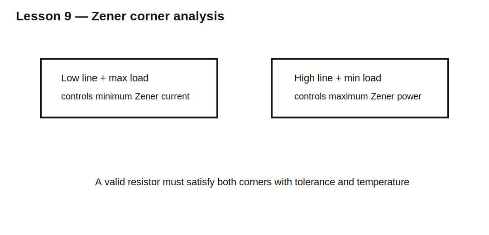

# Lesson 9 — Zener Design Across Line and Load Variation

> **Fast-track time:** 15–20 minutes  
> **Capability unlocked:** Prove a Zener regulator works at all input, load, tolerance, and temperature corners.

## Corner equations

At minimum input and maximum load:

$$I_{Z,min}=\frac{V_{IN,min}-V_{Z,max}}{R_{max}}-I_{L,max}$$

At maximum input and minimum load:

$$I_{Z,max}=\frac{V_{IN,max}-V_{Z,min}}{R_{min}}-I_{L,min}$$

Require:

$$I_{Z,min}\ge I_{knee}$$

and:

$$V_ZI_{Z,max}\le P_{Z,allowed}$$



## Include tolerance

Check:

- resistor tolerance;
- Zener-voltage tolerance at test current;
- dynamic resistance;
- load-current tolerance;
- input range;
- temperature coefficient;
- power derating.

A design that works only with nominal $V_Z$ is incomplete.

## Temperature coefficient

Low-voltage Zeners are dominated more by the Zener effect and often have negative temperature coefficient. Higher-voltage devices are more avalanche-dominated and often have positive coefficient. Around 5–6 V, the net coefficient can be relatively small.

Use the datasheet value, not a universal assumption.

## KiCad experiment

Parameterize input, load, resistor, and Zener model. Run explicit corners rather than one nominal sweep.

```spice
.param VIN=9 RSET=330 RLOAD=1k
.op
```

Record $V_{OUT}$, $I_Z$, $P_Z$, and $P_R$ for every corner.

## What to observe

- The low-line/full-load corner controls minimum Zener current.
- The high-line/no-load corner controls Zener power.
- Zener tolerance shifts both corners in opposite directions.
- Resistor tolerance matters because it directly controls available current.

## Design workflow

1. Set minimum required Zener current.
2. calculate maximum allowable resistor at low line;
3. calculate minimum resistor required by high-line power;
4. include tolerances;
5. verify an overlap exists;
6. choose a standard resistor within the valid range;
7. simulate temperature and load corners.

## Common mistakes

- Using one resistor equation at nominal values.
- Ignoring Zener-voltage tolerance.
- Forgetting resistor power at high line.
- Assuming more Zener current always improves the design.

## Design challenge

Design a 6.2 V regulator from 10–16 V for a 2–12 mA load. The Zener requires 3 mA minimum, has ±5% voltage tolerance, and may dissipate 500 mW maximum at 25°C before derating.

Determine whether a single resistor can meet all corners.