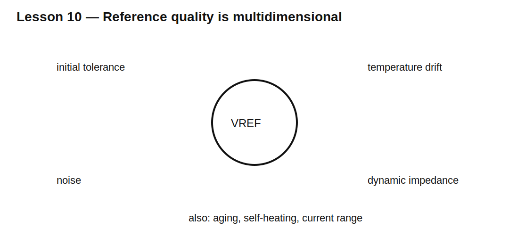

# Lesson 10 — Reference Diodes, Temperature Drift, and Noise

> **Fast-track time:** 15–20 minutes  
> **Capability unlocked:** Judge when a Zener is adequate as a reference and when precision reference circuitry is required.

## A reference is more than a nominal voltage

Important specifications include:

- initial tolerance;
- temperature coefficient;
- dynamic impedance;
- minimum operating current;
- broadband and low-frequency noise;
- long-term drift;
- line and load regulation;
- power and self-heating.

## Temperature drift

Approximate first-order drift:

$$\Delta V\approx V_{REF}\cdot TC\cdot\Delta T$$

where TC is in parts per million per degree Celsius.

Example: 5 V reference, 100 ppm/°C, 50°C change:

$$\Delta V=5(100\times10^{-6})(50)=25\text{ mV}$$

## Dynamic impedance and filtering

Current variation creates voltage variation:

$$\Delta V=r_Z\Delta I$$

An RC filter can reduce high-frequency noise, but loading and startup time must be included. A capacitor directly across some reference devices can affect stability; follow the datasheet.

## Self-heating

Power changes junction temperature, which then shifts voltage. A reference can drift when its own current changes even at constant ambient temperature.

## KiCad experiment

Model a 5.1 V Zener with 20 Ω dynamic resistance and a small noise source. Compare output for:

- 2 mA and 10 mA bias;
- 25°C and 85°C;
- no filter and 1 kΩ/10 µF filter.

Run DC, transient startup, and AC noise-oriented approximations.

## What to observe

- More current can reduce dynamic error but increases self-heating.
- Filtering reduces noise but slows startup.
- Temperature coefficient can dominate initial tolerance over a wide range.
- A precision bandgap reference can outperform a simple Zener at low current.

## Common mistakes

- Selecting only by nominal voltage.
- Ignoring long-term drift.
- Comparing noise without equal bandwidth.
- Adding a large capacitor without checking stability.
- Forgetting self-heating.

## Design challenge

A 5.0 V reference must stay within ±20 mV from 0–70°C. Compare a 5.1 V Zener with 200 ppm/°C drift against a 20 ppm/°C precision reference. Ignore initial tolerance first, then include ±1% and ±0.2% initial tolerance respectively.