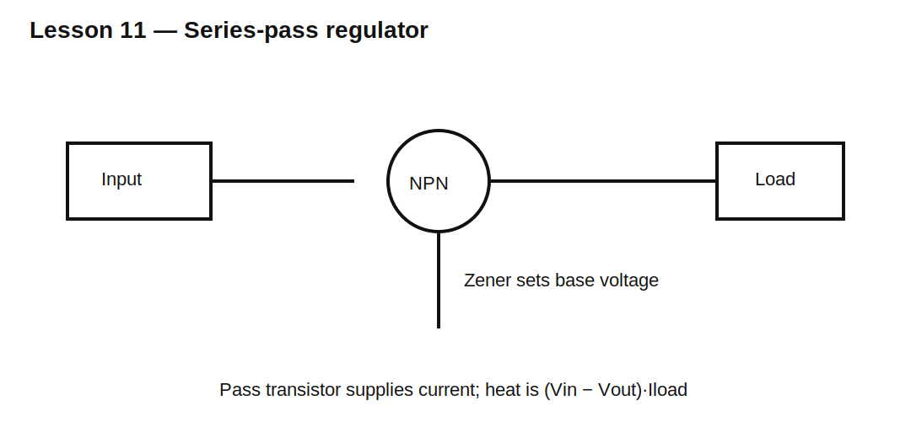

# Lesson 11 — Series-Pass Regulation with a Diode Reference

> **Fast-track time:** 15–20 minutes  
> **Capability unlocked:** Use a transistor as a current amplifier so a small reference can control a larger load.

## The idea

A Zener shunt regulator wastes current because it must carry the difference between source current and load current. A series-pass transistor places the control device in series with the load.

For an NPN emitter follower referenced by a Zener:

$$V_{OUT}\approx V_Z-V_{BE}$$



## Current gain

The transistor supplies load current while the Zener network supplies mostly base current:

$$I_B\approx\frac{I_L}{\beta}$$

The resistor feeding the Zener must provide both Zener current and base current.

## Dropout and headroom

The circuit requires enough input voltage for:

- Zener bias current;
- transistor base-emitter drop;
- transistor collector-emitter voltage;
- ripple and line variation.

As input falls, regulation eventually collapses.

## Power dissipation

The pass transistor dissipates approximately:

$$P_Q=(V_{IN}-V_{OUT})I_L$$

This often dominates the design.

## KiCad experiment

Use a 12 V source, 6.2 V Zener, NPN emitter follower, and load from 20–200 mA.

```spice
.dc V1 7 15 10m
.tran 10u 20m startup
```

Plot output voltage, Zener current, base current, and transistor power.

## What to observe

- Output is roughly one $V_{BE}$ below the Zener.
- Output changes with load because $V_{BE}$ and beta vary.
- Transistor power rises with input voltage and load current.
- At low input, Zener current collapses before the transistor can regulate.

## Common mistakes

- Assuming beta is fixed.
- Ignoring transistor SOA and heatsinking.
- Forgetting base current in the Zener-resistor calculation.
- Expecting precision regulation from an uncompensated emitter follower.

## Design challenge

Design an approximately 5 V, 100 mA regulator from 9–14 V using a Zener and NPN transistor. Assume beta may be 40–150 and $V_{BE}$ may be 0.6–0.8 V.

Choose the reference voltage and bias resistor, then calculate worst transistor power.