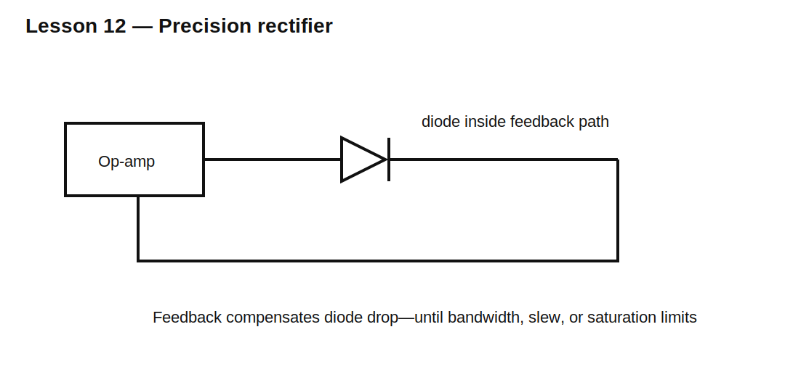

# Lesson 12 — Precision Rectification and Op-Amp Limits

> **Fast-track time:** 15–20 minutes  
> **Capability unlocked:** Understand how feedback removes most diode-drop error and where precision rectifiers still fail.

## Why an ordinary diode fails for small signals

A 100 mV signal cannot forward-bias a silicon diode strongly enough for accurate rectification. A precision rectifier puts the diode inside an op-amp feedback loop.

The op-amp drives its output far enough to make the external output follow the intended polarity despite diode forward drop.



## Ideal behavior

For a unity-gain half-wave precision rectifier:

- positive input: output follows input;
- negative input: diode opens and output is held by the alternate path or load.

The external transfer can approach an ideal diode.

## Real limitations

Accuracy is limited by:

- input offset voltage;
- input bias current;
- finite open-loop gain;
- gain-bandwidth product;
- slew rate;
- output swing and common-mode range;
- recovery from saturation;
- diode capacitance and reverse recovery.

## Saturation problem

In the simplest topology, the op-amp may saturate during the blocked half-cycle. It then requires time to recover, causing crossover distortion at higher frequency.

Improved topologies keep the amplifier out of deep saturation.

## KiCad experiment

Compare a normal diode rectifier and an op-amp precision rectifier for:

- 100 mV peak at 100 Hz;
- 1 V peak at 10 kHz;
- slow and fast op-amp models.

```spice
.tran 1u 30m startup
```

## What to observe

- The passive diode loses most of a 100 mV signal.
- Feedback largely removes the forward-drop error.
- Finite slew rate distorts high-frequency or large-amplitude signals.
- Saturation recovery creates errors around zero crossing.

## Common mistakes

- Assuming any op-amp works at any frequency.
- Ignoring input common-mode range near ground.
- Using a single-supply op-amp that cannot swing where required.
- Trusting an ideal op-amp model.

## Design challenge

Rectify a 20 mV–1 V, 1 kHz sine wave with less than 2 mV error near zero crossing.

Define the minimum op-amp offset, bandwidth, slew rate, input range, and output swing needed.