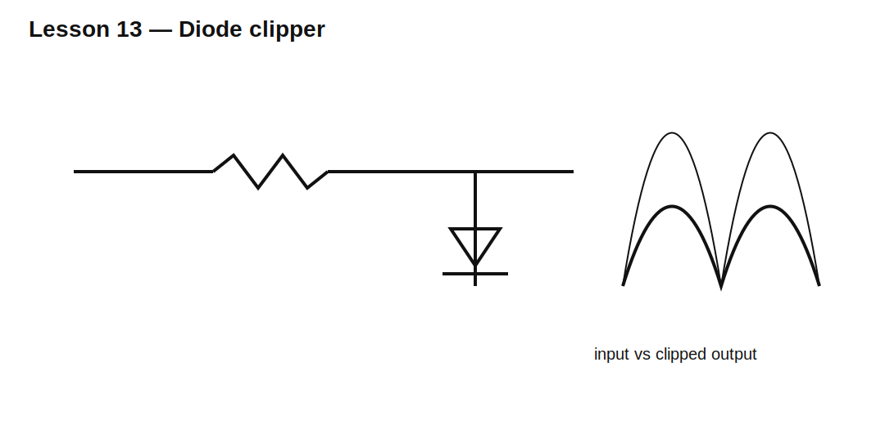

# Lesson 13 — Diode Clippers and Voltage Limiters

> **Fast-track time:** 15–20 minutes  
> **Capability unlocked:** Limit signal amplitude with diodes while controlling source current and distortion.

## Basic clipper

A diode connected from the signal node to a reference begins conducting when the node exceeds the reference by approximately the diode forward voltage.

For a clamp to ground:

$$V_{OUT,max}\approx V_F$$

A series resistor is required to limit current:

$$I_D\approx\frac{V_{IN}-V_{CLAMP}}{R_S}$$



## Symmetric limiting

Opposed diodes can limit positive and negative excursions. Two series diodes per direction raise the approximate threshold.

## Soft versus hard clipping

Real diode current rises exponentially, so clipping is gradual. Source resistance, load resistance, and diode type control the softness.

This matters in:

- input protection;
- waveform shaping;
- audio distortion;
- overvoltage limiting;
- logic-level translation.

## KiCad experiment

Drive a 10 V peak sine through 1 kΩ into:

1. one silicon diode to ground;
2. antiparallel silicon diodes;
3. antiparallel LEDs;
4. Schottky diodes.

```spice
.tran 10u 20m startup
```

Plot output voltage and diode current.

## What to observe

- Clipping threshold changes with current.
- Schottky clamps earlier than silicon.
- LEDs clamp at higher voltage and emit light only if current is sufficient.
- Smaller series resistance creates harder clipping and higher stress.
- Source impedance and load affect the actual threshold.

## Design workflow

1. Define allowed output range.
2. identify maximum input and source impedance;
3. choose diode type and reference;
4. choose series resistance from maximum clamp current;
5. check resistor and diode pulse power;
6. include load and capacitance;
7. verify recovery after the overload.

## Common mistakes

- Omitting the current-limiting resistor.
- Assuming the clamp voltage is exact.
- Ignoring current injected into the reference rail.
- Using a protection diode whose capacitance distorts the normal signal.

## Design challenge

Limit a ±12 V signal to approximately ±3.6 V for an ADC input. Normal signal bandwidth is 20 kHz, source impedance is 100 Ω, and clamp current must stay below 5 mA.

Choose a topology and series resistor, then quantify normal-signal loading.