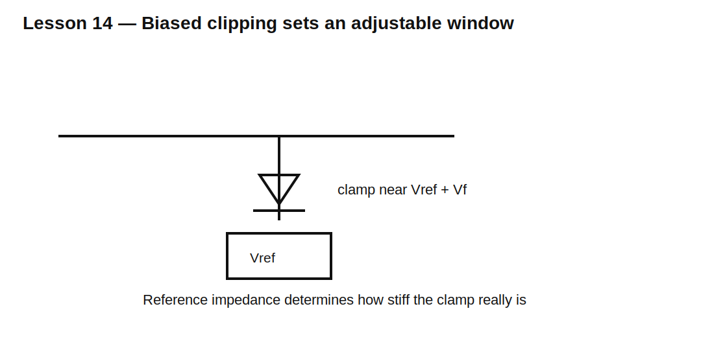

# Lesson 14 — Biased Clippers and Adjustable Thresholds

> **Fast-track time:** 15–20 minutes  
> **Capability unlocked:** Set clipping thresholds relative to a reference instead of ground.

## Shift the threshold

A diode connected to a reference voltage $V_R$ conducts when:

$$V_{OUT}\gtrsim V_R+V_F$$

For a negative clamp, orientation reverses and the threshold is approximately:

$$V_{OUT}\lesssim V_R-V_F$$



## Reference stiffness

When the diode conducts, clamp current flows into or out of the reference. If the reference has finite impedance, its voltage moves:

$$\Delta V_R=I_DZ_R$$

A divider alone may be too weak. A bypass capacitor or buffer can make the reference stiffer over the transient duration.

## Asymmetric clipping

Different positive and negative references create an unequal window, useful for:

- ADC inputs;
- sensor interfaces;
- level shifting;
- waveform generation;
- protection around a midpoint bias.

## KiCad experiment

Drive a ±8 V sine through 2.2 kΩ. Clamp the output between −1 V and +4 V using two biased diode paths.

```spice
.tran 5u 20m startup
```

Compare an ideal reference with a 10 kΩ divider reference and then add 10 µF bypass capacitance.

## What to observe

- Clamp level includes diode forward voltage.
- Reference impedance causes clamp movement.
- A bypass capacitor improves short-pulse stiffness but not indefinite DC current capability.
- Different diode currents produce different positive and negative thresholds.

## Common mistakes

- Assuming the reference absorbs unlimited current.
- Forgetting clamp current can back-power another rail.
- Ignoring capacitor recharge between events.
- Designing from nominal diode drop only.

## Design challenge

Protect a 0–3.3 V ADC against a −10 to +12 V sensor fault. Limit the pin to −0.3 to 3.6 V and keep injected current below 2 mA.

Choose clamp references, diode type, and series resistance. Explain what happens when the 3.3 V rail is unpowered.