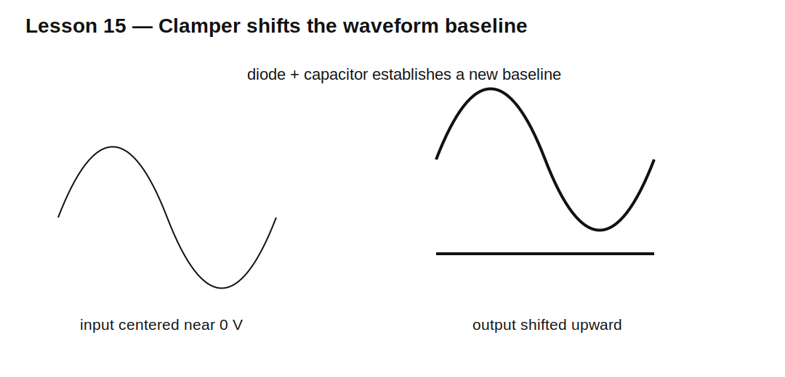

# Lesson 15 — DC Restorers and Clamper Circuits

> **Fast-track time:** 15–20 minutes  
> **Capability unlocked:** Shift an AC waveform’s DC level without changing its peak-to-peak amplitude substantially.

## The idea

A clamper uses a diode, capacitor, and resistance to charge the capacitor during one part of the waveform. The stored capacitor voltage then shifts the whole waveform up or down.

Unlike a clipper, a clamper ideally preserves peak-to-peak amplitude while changing baseline.



## Positive clamper

A positive clamper shifts the waveform upward so its negative peak is near the reference level.

During the clamping interval, the diode conducts and charges C. During the remainder, the diode opens and the capacitor acts approximately like a voltage source in series with the input.

## Time-constant requirement

The discharge path should be slow compared with the signal period:

$$RC\gg T$$

If RC is too small, the capacitor voltage droops and the baseline shifts during each cycle.

## Loaded output

The load resistance is part of the discharge path. Source resistance and diode current also influence charging accuracy.

## KiCad experiment

Use a ±2 V, 1 kHz sine wave, 1 µF capacitor, diode to ground, and load values of 10 kΩ, 100 kΩ, and 1 MΩ.

```spice
.tran 2u 20m startup
```

Measure output minimum, maximum, and cycle-to-cycle baseline.

## What to observe

- The output shifts by approximately input peak minus diode drop.
- Smaller load resistance creates more droop.
- Startup requires several cycles to reach steady state.
- Reversing diode direction reverses the shift.
- A biased reference shifts the clamp level.

## Design workflow

1. Define input amplitude, frequency, and desired clamp level.
2. choose diode polarity;
3. choose C so loaded RC is much longer than the period;
4. check charging current and source resistance;
5. include diode drop and leakage;
6. verify startup and duty-cycle dependence.

## Common mistakes

- Confusing a clamper with a clipper.
- Ignoring load resistance.
- Starting simulation from a precharged operating point and missing startup.
- Assuming perfect baseline restoration for arbitrary duty cycle.

## Design challenge

Shift a 4 V peak-to-peak, 500 Hz sine wave so its negative peak stays within −0.1 to +0.2 V.

The load is 47 kΩ. Choose diode type and capacitor value, and verify droop below 2% per cycle.