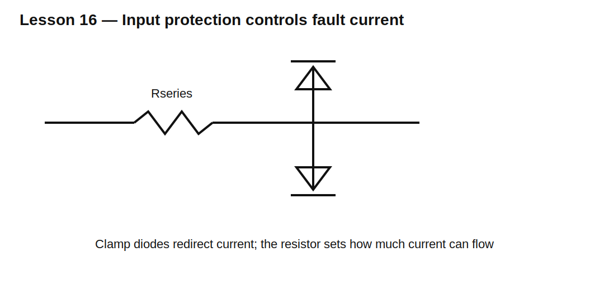

# Lesson 16 — Input Protection with Series Resistance and Clamp Diodes

> **Fast-track time:** 15–20 minutes  
> **Capability unlocked:** Protect a sensitive input by controlling fault current and giving it a safe return path.

## The protection idea

A common protection network contains:

- a series resistor;
- an upper clamp diode;
- a lower clamp diode;
- optional RC filtering;
- a rail or dedicated clamp node capable of absorbing current.



During a positive fault, current flows through the resistor and upper diode. During a negative fault, current flows through the lower diode.

## Size the resistor from fault current

For a positive fault:

$$R\ge\frac{V_{FAULT,max}-V_{CLAMP,max}}{I_{INJECT,max}}$$

For a negative fault:

$$R\ge\frac{|V_{FAULT,min}-V_{CLAMP,min}|}{I_{INJECT,max}}$$

Use the larger requirement and include source resistance only if it is guaranteed.

## The clamp rail must absorb current

A diode to the 3.3 V rail does not make energy disappear. Clamp current enters that rail. If the rail cannot sink current, its voltage may rise or the circuit may become back-powered.

Possible solutions:

- dedicated TVS or shunt rail;
- rail sink or preload;
- active disconnect;
- series switch;
- clamp to a robust reference node.

## Normal-signal loading

The series resistor and input capacitance form a low-pass filter:

$$f_c=\frac{1}{2\pi R_SC_{IN}}$$

For an ADC sample-and-hold input, settling during acquisition may be more important than the simple −3 dB frequency.

## KiCad experiment

Drive a protected node from −12 V to +12 V through 4.7 kΩ. Use Schottky clamps to 0 V and 3.3 V, and model a 20 pF input.

```spice
.tran 100n 10m startup
```

Measure clamp current, pin voltage, and rail current.

## What to observe

- The resistor sets the fault current.
- Schottky diodes conduct before many internal silicon clamps.
- The pin may still exceed the rail slightly.
- An unpowered rail can be lifted by the fault.
- Larger resistance improves protection but slows acquisition.

## Common mistakes

- Checking only pin voltage and not injected current.
- Assuming the supply rail can absorb current.
- Ignoring negative faults.
- Forgetting leakage and capacitance in normal operation.
- Relying on undocumented internal protection diodes.

## Design challenge

Protect a 0–2.5 V sensor input against ±24 V wiring faults. The ADC allows ±1 mA injection and has 30 pF input capacitance. The signal bandwidth is 2 kHz.

Choose a resistor and clamp strategy, then verify bandwidth, fault current, and power-off behavior.