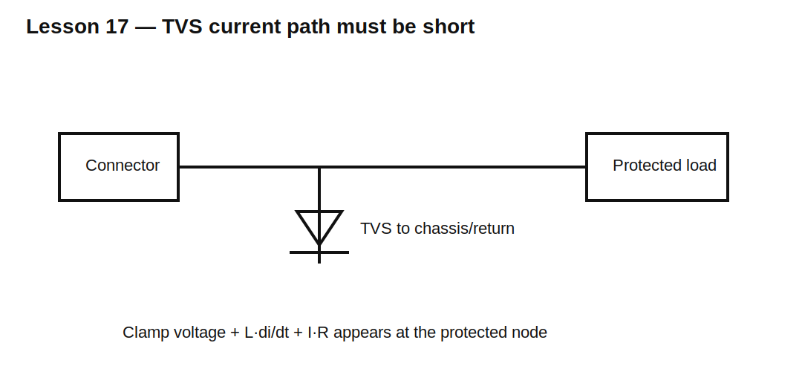

# Lesson 17 — ESD, TVS Diodes, and Transient-Energy Paths

> **Fast-track time:** 15–20 minutes  
> **Capability unlocked:** Choose and place a transient suppressor from waveform, clamping voltage, current, energy, and layout.

## ESD is not a DC overvoltage

Electrostatic discharge has:

- very fast rise time;
- high peak current;
- short duration;
- significant high-frequency content;
- strong sensitivity to trace inductance.

A TVS diode provides a low-impedance path during the pulse, but the protected voltage is not equal to its printed standoff voltage.



## Key TVS specifications

- **VRWM:** maximum reverse working voltage;
- **VBR:** breakdown voltage at a test current;
- **VC:** clamping voltage at a specified pulse current;
- **IPP:** rated peak pulse current;
- pulse waveform and duration;
- capacitance;
- leakage;
- package inductance and thermal limits.

## Dynamic clamp voltage

A useful approximation is:

$$V_{protected}\approx V_C+L_{path}\frac{di}{dt}+I_PR_{path}$$

At ESD edge rates, even a few nanohenries can add significant overshoot.

## Placement and return path

Place the TVS:

- near the connector;
- before sensitive circuitry;
- with a short path to chassis or intended return;
- so surge current does not flow through the protected ground path.

## KiCad experiment

Model a current pulse into a connector node, a TVS, 5 nH path inductance, 1 Ω source resistance, and a protected load.

```spice
.tran 50p 200n startup
```

Compare 1 nH, 5 nH, and 20 nH return paths.

## What to observe

- TVS clamping is current-dependent.
- Path inductance creates an initial voltage spike.
- A lower-capacitance TVS may clamp less strongly.
- Adding series impedance after the connector reduces current reaching the protected node.

## Common mistakes

- Selecting only by standoff voltage.
- Ignoring clamping voltage at actual current.
- Placing the TVS far from the connector.
- Routing surge return through logic ground.
- Using a high-capacitance TVS on a fast data line without analysis.

## Design challenge

Protect a 12 V external input against a 30 A, 8/20 µs surge while keeping the downstream node below 28 V. The TVS path has 20 mΩ resistance and 15 nH inductance.

Define the required TVS data and explain why the 15 nH term matters more for ESD than for the 8/20 µs surge.