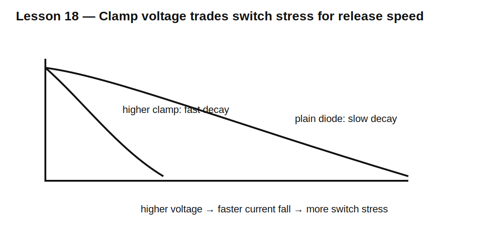

# Lesson 18 — Flyback Diodes Revisited: Release Time Versus Voltage Stress

> **Fast-track time:** 15–20 minutes  
> **Capability unlocked:** Choose a flyback path from required current-decay time, switch voltage, and repetitive energy.

## Stored magnetic energy

An energized coil stores:

$$E_L=\frac12LI^2$$

When the switch opens, current must continue. The clamp path determines both voltage and release speed.



## Plain diode clamp

A diode across the coil limits the switch-node voltage to roughly one diode drop beyond the supply rail. This protects the switch well, but the low clamp voltage produces slow current decay.

Approximate decay with coil resistance R and diode drop $V_D$:

$$L\frac{di}{dt}+Ri+V_D=0$$

The current falls more slowly than with a higher-voltage clamp.

## Higher clamp voltage

A Zener, TVS, or diode-plus-Zener path allows a larger voltage:

$$\left|\frac{di}{dt}\right|\approx\frac{V_{clamp}}{L}$$

Higher clamp voltage means:

- faster relay or solenoid release;
- more switch voltage stress;
- greater EMI and ringing risk;
- more demanding clamp energy rating.

## KiCad experiment

Use a 24 V supply, 100 mH coil, 24 Ω winding, and MOSFET switch. Compare:

1. plain diode;
2. diode plus 24 V Zener;
3. 48 V TVS clamp.

```spice
.tran 10u 100m startup
```

Measure time for current to fall from steady state to 10% and peak switch voltage.

## What to observe

- A plain diode gives the lowest switch voltage and slowest release.
- Higher clamp voltage shortens release time.
- Wiring inductance adds overshoot above the intended clamp.
- Clamp energy remains close to the initial magnetic energy minus winding loss.

## Common mistakes

- Selecting the diode only from steady coil current.
- Ignoring release-time requirements.
- Assuming all magnetic energy is dissipated only in the diode.
- Omitting wiring inductance and switch capacitance.
- Failing to check repetitive power at high switching rate.

## Design challenge

A 12 V relay coil has 240 Ω resistance and 80 mH inductance. Current must fall below 10 mA within 3 ms, and the MOSFET must remain below 40 V.

Compare a plain diode and a higher-voltage clamp. Choose a clamp target and calculate initial stored energy.