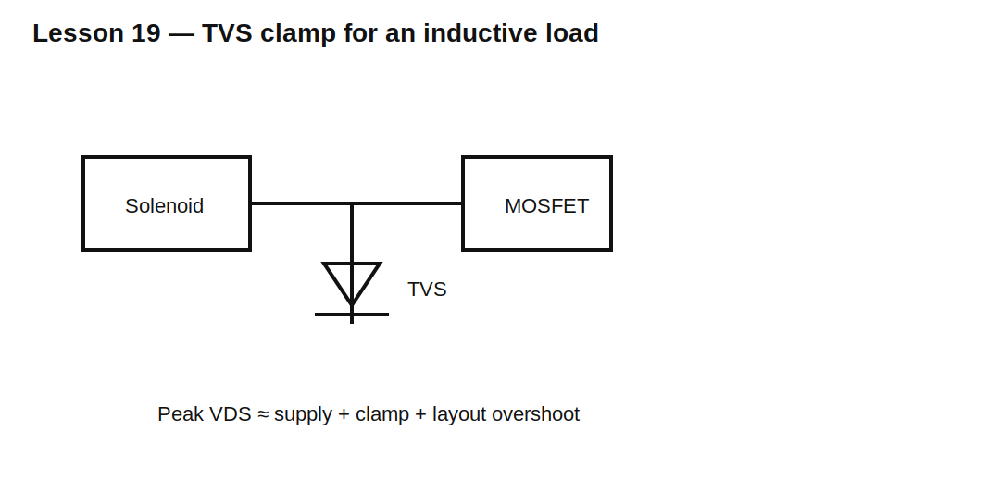

# Lesson 19 — Zener and TVS Clamps for Inductive Loads

> **Fast-track time:** 15–20 minutes  
> **Capability unlocked:** Size a higher-voltage inductive clamp from switch rating, coil energy, tolerance, and repetition rate.

## The clamp window

A useful clamp must be:

- high enough to release the load quickly;
- low enough to protect the switch;
- capable of absorbing repetitive energy;
- stable over current and temperature.

For a low-side switch, approximate peak drain voltage is:

$$V_{DS,pk}\approx V_S+V_{clamp}+V_{overshoot}$$

## TVS voltage is not one number

Check:

- standoff voltage;
- breakdown range;
- clamping voltage at actual current;
- dynamic resistance;
- pulse-power waveform;
- temperature derating;
- repetitive average power.

## Energy and repetition

Initial magnetic energy:

$$E_L=\frac12LI_0^2$$

Average clamp power at repetition rate f is bounded approximately by:

$$P_{AVG}\lesssim E_Lf$$

Some energy is dissipated in winding resistance and the switch, but use a conservative first estimate.

## KiCad experiment

Use a 24 V, 200 mH, 30 Ω solenoid and compare 24 V, 36 V, and 48 V clamp voltages. Add 100 nH wiring inductance.

Measure current-decay time, TVS energy, and switch overshoot.

## What to observe

- Clamp voltage rises with current according to dynamic resistance.
- Higher voltage shortens release time.
- Wiring inductance creates a fast spike before the TVS fully conducts.
- Repetitive thermal stress can dominate even when one pulse is safe.

## Common mistakes

- Using TVS standoff voltage as the clamp voltage.
- Ignoring tolerance and temperature.
- Checking pulse power but not average repetitive power.
- Omitting the supply voltage from MOSFET stress.

## Design challenge

A 24 V solenoid stores 90 mJ and switches 8 times per second. The MOSFET is rated 80 V and layout overshoot is estimated at 8 V.

Choose a maximum TVS clamp voltage with margin and estimate worst average TVS power.