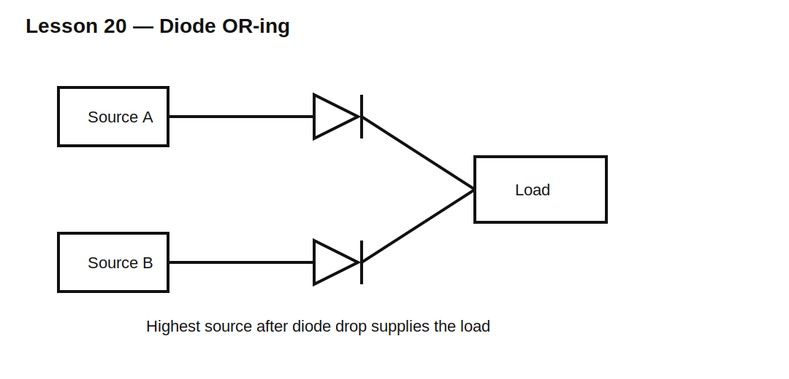

# Lesson 20 — Diode OR-ing and Supply Selection

> **Fast-track time:** 15–20 minutes  
> **Capability unlocked:** Combine multiple power sources without allowing one source to backfeed another.

## Basic OR-ing

Each source feeds the load through a diode. The source with the highest voltage after diode drop supplies most or all current.

$$V_{OUT}\approx\max(V_1-V_{F1},V_2-V_{F2},\ldots)$$

## Why current may not share equally

Diode forward voltage changes with:

- current;
- temperature;
- device mismatch;
- wiring resistance.

Two equal nominal supplies rarely share perfectly through ordinary diodes. The warmer diode may conduct more, depending on the surrounding resistance and thermal coupling.

## Drop and loss

$$P_D\approx V_FI$$

At low voltages, even a Schottky drop can consume substantial efficiency and reduce load headroom.

## Reverse leakage

The off source sees reverse voltage. Leakage may:

- charge an unpowered rail;
- violate standby-current limits;
- create unsafe connector voltage;
- confuse source detection.

## KiCad experiment

Use 5.0 V and 4.8 V sources, each through a Schottky diode, feeding a 10 Ω load. Sweep one source from 4–6 V and plot each diode current.

Then add 100 mΩ series resistance to each source.

## What to observe

- One source dominates until the other exceeds it by the forward-drop difference.
- Small voltage changes can transfer large current.
- Series resistance smooths current handoff and encourages sharing.
- Leakage becomes visible when one source is off.

## Common mistakes

- Assuming equal current sharing.
- Ignoring diode loss and thermal rise.
- Forgetting reverse leakage into an unpowered source.
- Selecting reverse-voltage rating without transient margin.

## Design challenge

OR a 5.0 V adapter and a 4.2–3.0 V battery into a load requiring 4.5–5.0 V at 1 A.

Determine whether passive diode OR-ing can meet the voltage requirement. Compare silicon, Schottky, and ideal-diode approaches.