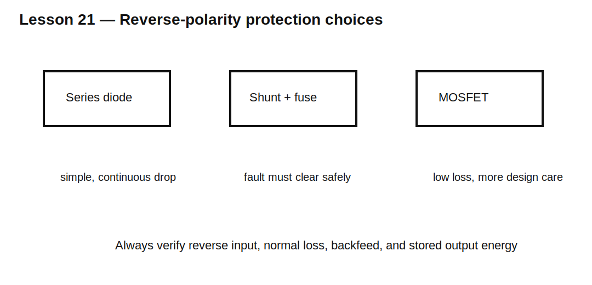

# Lesson 21 — Reverse-Polarity Protection

> **Fast-track time:** 15–20 minutes  
> **Capability unlocked:** Prevent damage from a reversed supply while minimizing voltage loss and fault energy.

## Series diode protection

A diode in series blocks reverse current.

Advantages:

- simple;
- predictable;
- low part count.

Disadvantages:

- forward-voltage loss;
- continuous power dissipation;
- reduced load headroom.

$$P_D\approx V_FI$$

## Shunt diode plus fuse

A reverse-connected diode across the input conducts heavily when polarity is wrong, forcing a fuse or current-limited source to open.

This protects downstream voltage but creates a deliberate short-circuit path. It is safe only when:

- the source current is bounded;
- the fuse clears;
- the diode survives the clearing energy;
- wiring can tolerate the fault.

## MOSFET protection

A correctly oriented P-channel or N-channel MOSFET can behave like a low-loss diode after startup. The body diode permits initial current in the desired direction, then gate drive enhances the channel.

Check:

- gate-source maximum voltage;
- reverse input transients;
- startup behavior;
- backfeed direction;
- source/load ordering;
- body-diode current before enhancement.

## KiCad experiment

Compare at 2 A:

1. silicon diode;
2. Schottky diode;
3. MOSFET with 25 mΩ on-resistance.

Sweep input from −15 V to +15 V and measure output, current, and loss.

## What to observe

- Series diodes block reverse voltage immediately.
- Schottky loss is lower but leakage is higher.
- MOSFET loss scales as $I^2R_{DS(on)}$.
- A MOSFET can conduct unexpectedly through its body diode if oriented incorrectly.

## Common mistakes

- Reversing source and drain based only on symbol appearance.
- Ignoring MOSFET gate-voltage limits.
- Using a shunt diode without fuse coordination.
- Forgetting an output capacitor can backfeed the input.

## Design challenge

Protect a 12 V, 3 A product against −15 V reverse connection. Normal loss must stay below 0.5 W.

Compare a Schottky diode and MOSFET solution. State the required MOSFET $R_{DS(on)}$, voltage rating, and gate protection.