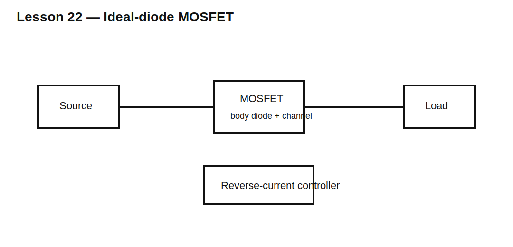

# Lesson 22 — Ideal-Diode MOSFET Concepts

> **Fast-track time:** 15–20 minutes  
> **Capability unlocked:** Understand how a controller and MOSFET emulate a diode with millivolt-scale forward loss.

## Why use an ideal diode

A power diode may lose hundreds of millivolts. A MOSFET in the on-state loses:

$$V_{DROP}=IR_{DS(on)}$$

At 5 A and 10 mΩ:

$$V_{DROP}=50\text{ mV}$$

The controller senses forward and reverse voltage and drives the MOSFET gate so current is allowed in one direction and blocked in the other.

## Body-diode startup

Before the MOSFET is enhanced, its body diode may conduct. Orientation is chosen so the body diode supports intended startup but blocks the undesired steady reverse path after the controller turns the MOSFET off.

## Reverse-current detection

The controller must turn off quickly when:

- input falls below output;
- another OR-ed source rises;
- output capacitance tries to backfeed input;
- the connector is removed or shorted.

Turn-off delay and parasitic inductance can still allow a reverse-current pulse.

## Gate-drive limits

Check:

- maximum $V_{GS}$;
- gate-source clamp;
- controller supply range;
- MOSFET threshold versus full enhancement;
- gate charge and switching speed;
- common-source inductance.

## KiCad experiment

Use two supplies OR-ed through MOSFETs controlled by behavioral comparators. Compare with Schottky OR-ing at 3 A.

Measure voltage drop, handoff current, reverse-current pulse, and loss.

## What to observe

- MOSFET drop can be far lower than diode drop.
- The body diode conducts during startup and fast transitions.
- Slow turn-off permits reverse current.
- Very fast switching can create ringing and EMI.
- Controller quiescent current matters in battery systems.

## Common mistakes

- Calling a bare MOSFET an ideal diode without a control mechanism.
- Assuming the body diode blocks both directions.
- Ignoring reverse-current response time.
- Choosing $R_{DS(on)}$ at an unavailable gate voltage.

## Design challenge

OR two 12 V sources into a 5 A load with less than 100 mV normal drop and less than 1 A reverse-current peak during handoff.

Specify MOSFET resistance, controller behavior, gate clamp, and measurements required.