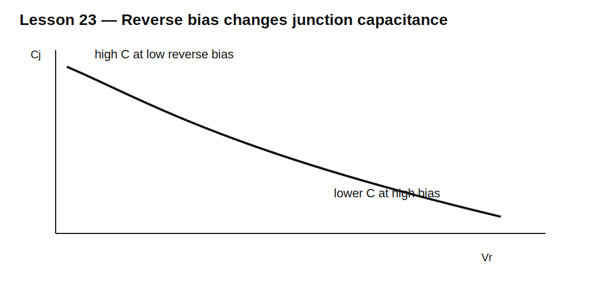

# Lesson 23 — Junction Capacitance and Varactor Behavior

> **Fast-track time:** 15–20 minutes  
> **Capability unlocked:** Predict how a reverse-biased diode behaves as a voltage-dependent capacitor.

## Depletion capacitance

Reverse bias widens the depletion region. A wider region stores less charge per volt, so junction capacitance falls as reverse voltage rises.

A common model is:

$$C_J(V)=\frac{C_{J0}}{(1+V_R/V_J)^m}$$

where $m$ depends on the junction profile.

## Why this matters

Junction capacitance affects:

- high-speed clamp loading;
- RF switch isolation;
- rectifier switching;
- oscillator tuning;
- detector sensitivity;
- signal distortion.

A varactor diode is optimized to exploit this voltage-dependent capacitance intentionally.

## Resonant tuning

With an inductor L:

$$f_0=\frac{1}{2\pi\sqrt{LC}}$$

Changing reverse bias changes C and therefore frequency.

## Signal distortion

Because capacitance changes with instantaneous voltage, a large AC signal modulates its own capacitance. This creates harmonics and intermodulation.

Use back-to-back varactors when a more symmetric capacitance-versus-signal relationship is needed.

## KiCad experiment

Use a diode model with $C_{J0}=100$ pF, $V_J=1$ V, and $m=0.5$. Bias it from 0–10 V through a large resistor and place it in parallel with a 10 µH inductor.

Run AC sweeps at several bias voltages.

## What to observe

- Capacitance decreases as reverse bias increases.
- Resonant frequency rises with bias.
- Bias resistor and bypass capacitor must isolate the RF path.
- Package and layout parasitics limit the useful tuning range.

## Common mistakes

- Treating reverse-biased diodes as open circuits at high frequency.
- Ignoring voltage-dependent capacitance in protection networks.
- Applying forward bias to a varactor during part of the cycle.
- Using nominal capacitance without the bias point.

## Design challenge

Tune an LC resonator from 8 MHz to 12 MHz using a 1 µH inductor and one or more varactors.

Calculate the required capacitance range and propose a bias network that does not load the resonator.