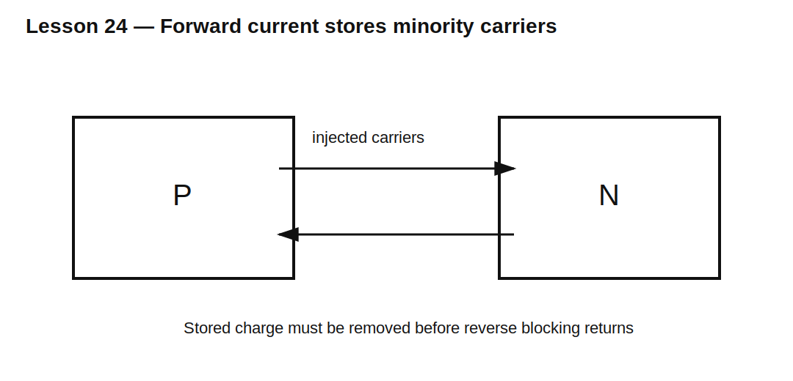

# Lesson 24 — Diffusion Capacitance and Stored Charge

> **Fast-track time:** 15–20 minutes  
> **Capability unlocked:** Explain why a forward-biased PN diode stores charge and cannot stop conducting instantly.

## Forward conduction stores carriers

When a PN diode is forward-biased, minority carriers are injected into the neighboring regions. The total stored charge is approximately related to forward current and carrier lifetime:

$$Q_S\approx I_F\tau_T$$

where $\tau_T$ is an effective transit or storage time.



## Diffusion capacitance

A small change in forward voltage changes stored charge. The incremental diffusion capacitance is:

$$C_D=\frac{dQ}{dV}\approx\frac{\tau_T I_D}{nV_T}$$

Unlike depletion capacitance, diffusion capacitance dominates mainly under forward bias and grows with current.

## Why the diode keeps conducting

When voltage reverses, the stored carriers must be removed before the junction regains blocking ability. Reverse current initially flows to extract this charge.

This creates:

- storage delay;
- reverse-recovery current;
- switching loss;
- EMI;
- stress in the commutating switch.

## Charge control view

A useful engineering model is:

$$\frac{dQ}{dt}=I_{in}-\frac{Q}{\tau_T}$$

Forward current builds charge; recombination and reverse current remove it.

## KiCad experiment

Compare two diode models identical except for transit time $T_T$:

- 5 ns;
- 200 ns.

Drive each forward at 100 mA, then reverse the source rapidly.

```spice
.tran 1n 5u startup
```

Plot diode current and junction voltage.

## What to observe

- Larger transit time creates more stored charge.
- Reverse current continues while the diode voltage remains near forward conduction.
- Higher forward current increases stored charge.
- A slower current transition may reduce peak reverse current but lengthen recovery.

## Common mistakes

- Treating forward-biased diode capacitance as only $C_{J0}$.
- Assuming voltage reversal immediately stops current.
- Comparing recovery without equal forward current and $di/dt$.
- Assuming all simulator diode models include realistic stored charge.

## Design challenge

A diode carries 2 A and has effective transit time 50 ns.

Estimate stored charge. If reverse current is approximately 4 A, estimate the shortest possible charge-removal interval, ignoring recombination and waveform shape.