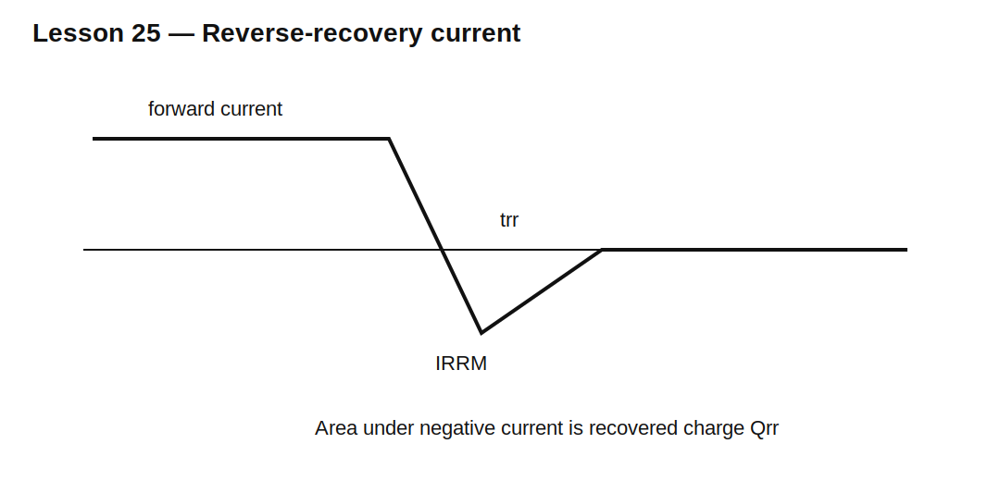

# Lesson 25 — Reverse Recovery from First Principles

> **Fast-track time:** 15–20 minutes  
> **Capability unlocked:** Read and predict reverse-recovery current, charge, timing, and switching stress.

## The commutation event

A forward-conducting PN diode contains stored charge. When another switch forces reverse voltage, current first becomes negative while that charge is removed.



Important quantities:

- $I_F$: forward current before commutation;
- $di/dt$: forced current slope;
- $I_{RRM}$: peak reverse-recovery current;
- $t_{rr}$: reverse-recovery time;
- $Q_{rr}$: recovered charge.

$$Q_{rr}=\int |i_R(t)|dt$$

For a triangular approximation:

$$Q_{rr}\approx\frac12I_{RRM}t_{rr}$$

## What controls recovery

- previous forward current;
- junction temperature;
- forced $di/dt$;
- device technology;
- carrier lifetime;
- circuit inductance;
- reverse voltage.

Datasheet $t_{rr}$ is meaningful only with its stated test conditions.

## System consequences

The commutating switch must carry load current plus diode reverse current. Approximate extra turn-on energy is related to bus voltage and recovered charge:

$$E_{rr}\sim V_{BUS}Q_{rr}$$

The exact value depends on overlap and waveform shape.

Recovery-current fall can excite stray inductance and capacitance, creating ringing and overshoot.

## Softness

A soft-recovery diode returns gradually toward zero current and usually produces less ringing. An abrupt diode may have lower nominal recovery time yet create higher EMI and voltage stress.

## KiCad experiment

Drive a diode at 1 A through an inductor, then turn on a second switch to commutate current at controlled $di/dt$. Compare models with 10 ns and 100 ns transit time.

```spice
.tran 200p 10u startup
```

Measure $I_{RRM}$, $t_{rr}$, $Q_{rr}$, switch peak current, and ringing.

## What to observe

- Faster forced $di/dt$ usually raises peak reverse current.
- Higher temperature often increases recovered charge.
- Schottky models show displacement current but little minority-carrier recovery.
- Parasitic inductance turns current slope into voltage overshoot.

## Common mistakes

- Comparing datasheet $t_{rr}$ values from different test conditions.
- Ignoring reverse recovery in the opposite switch’s current rating.
- Assuming a lower $t_{rr}$ always means lower EMI.
- Trusting a diode model whose $T_T$ is zero.

## Design challenge

A diode has $I_{RRM}=3$ A and $t_{rr}=60$ ns under a 400 V switching condition.

Estimate $Q_{rr}$ with a triangular waveform and the order of magnitude of recovery energy per cycle. Then estimate average recovery power at 100 kHz.