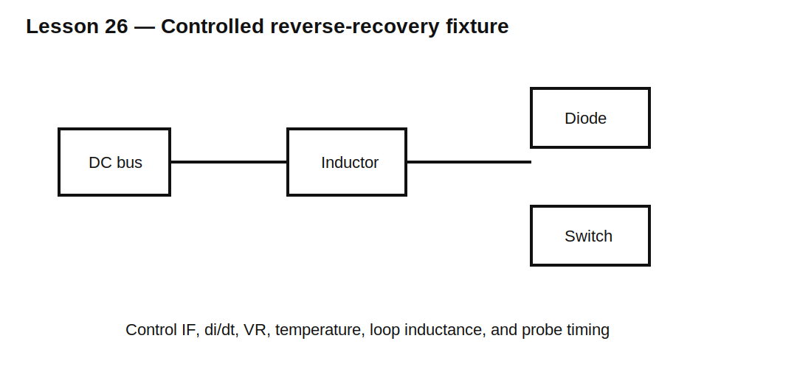

# Lesson 26 — Reverse-Recovery Test Circuits and Measurement

> **Fast-track time:** 15–20 minutes  
> **Capability unlocked:** Build and interpret a controlled diode reverse-recovery test instead of comparing unrelated datasheet numbers.

## The purpose of the fixture

Reverse recovery depends on the circuit that forces the current transition. A useful test fixture controls:

- forward current before commutation;
- reverse voltage;
- current slope $di/dt$;
- junction temperature;
- loop inductance;
- measurement bandwidth.



## Common double-pulse structure

1. An inductor establishes approximately constant current.
2. The diode carries that current during freewheel.
3. A controlled switch turns on and commutates current away from the diode.
4. The switch current contains load current plus diode reverse-recovery current.

Measure:

- diode current;
- diode voltage;
- switch current;
- bus voltage;
- switching-node voltage.

## Extracting quantities

Peak reverse current:

$$I_{RRM}=|I_{D,min}|$$

Recovered charge:

$$Q_{rr}=\int_{t_1}^{t_2}|i_D(t)|dt$$

Recovery time is defined using a specified endpoint, often a fraction of peak reverse current. Use the same definition when comparing parts.

## Probe and fixture errors

Current shunts add inductance and voltage. Current probes have bandwidth and deskew error. Voltage and current channels must be time-aligned before calculating energy.

A few nanoseconds of timing error can materially change:

$$E=\int v(t)i(t)dt$$

## KiCad/ngspice experiment

Use a 100 V bus, 100 µH inductor, 1 A initial current, and controlled switch edge. Compare $di/dt$ values by changing gate rise time or series inductance.

```spice
.tran 100p 10u startup
```

Measure $I_{RRM}$, $Q_{rr}$, $t_{rr}$, and switch peak current.

## What to observe

- Higher $di/dt$ usually raises peak reverse current.
- The same diode can show different $t_{rr}$ under different conditions.
- Parasitic inductance produces ringing after recovery.
- Channel deskew changes calculated switching energy.

## Common mistakes

- Comparing datasheet values from different test circuits.
- Measuring diode current indirectly without accounting for branch currents.
- Integrating noise and ringing far beyond the recovery interval.
- Ignoring temperature.
- Using an ideal switch that forces unrealistic current slope.

## Design challenge

Define a test for two 600 V diodes at 5 A, 400 V reverse bias, and 100 A/µs. Specify the inductor, switch requirements, current measurement, voltage probe, timing reference, and pass/fail measurements.