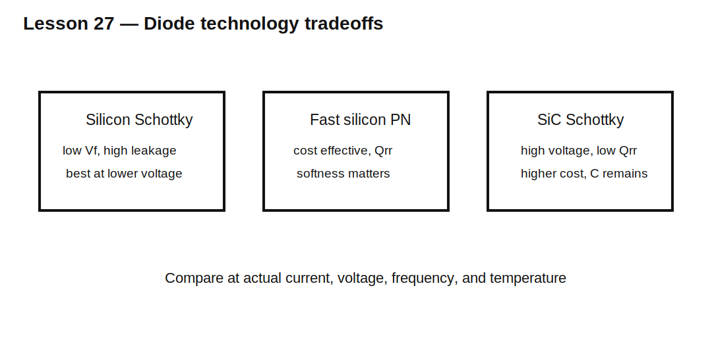

# Lesson 27 — Schottky, Fast-Recovery, and Silicon-Carbide Tradeoffs

> **Fast-track time:** 15–20 minutes  
> **Capability unlocked:** Choose a diode technology from voltage, current, recovery, leakage, capacitance, and cost.

## Three common families

### Schottky diode

Majority-carrier device with little stored-charge recovery.

Strengths:

- low forward voltage at low-to-moderate voltage;
- very fast switching;
- low reverse-recovery charge.

Tradeoffs:

- higher reverse leakage;
- strong leakage increase with temperature;
- limited voltage range for many silicon parts;
- often significant junction capacitance.

### Fast-recovery silicon PN diode

Minority-carrier device optimized for shorter lifetime.

Strengths:

- broad voltage range;
- often lower cost;
- controlled softness options.

Tradeoffs:

- nonzero $Q_{rr}$;
- switching loss and EMI;
- forward drop usually above low-voltage Schottky.

### Silicon-carbide Schottky diode

Wide-bandgap majority-carrier device.

Strengths:

- negligible minority-carrier recovery;
- high reverse-voltage capability;
- strong high-temperature behavior;
- useful in high-voltage converters.

Tradeoffs:

- higher cost;
- forward drop may be higher than silicon Schottky;
- capacitance and displacement current still matter.

## Selection metrics

Compare at the actual operating point:

- $V_F(I,T)$;
- $Q_{rr}(I,di/dt,T)$;
- reverse leakage at hot temperature;
- capacitance versus reverse voltage;
- surge-current capability;
- package thermal resistance;
- avalanche or unclamped-inductive capability if applicable.

## Loss estimate

Conduction:

$$P_{cond}\approx V_FI_{AVG}$$

Recovery-related switching loss:

$$P_{rr}\sim V_{BUS}Q_{rr}f_s$$

Capacitive loss remains even without stored charge:

$$E_C\approx\int_0^{V}C(V)v\,dv$$

## KiCad experiment

Compare representative models at:

- 24 V, 5 A, 200 kHz;
- 400 V, 5 A, 100 kHz;
- 25°C and 125°C.

Plot forward loss, reverse current, switch peak current, and recovery energy.

## What to observe

- Silicon Schottky often wins at low voltage.
- SiC often wins at high voltage and high frequency.
- Fast PN diodes may be economical when switching loss is acceptable.
- A “zero recovery” device can still produce capacitive current spikes.

## Common mistakes

- Comparing only room-temperature forward voltage.
- Treating SiC as lossless.
- Ignoring Schottky leakage at hot temperature.
- Using $t_{rr}$ alone instead of $Q_{rr}$ and softness.

## Design challenge

Choose a freewheel diode for a 400 V, 8 A, 100 kHz hard-switched converter. Compare a 600 V ultrafast silicon diode and a 650 V SiC diode using conduction, recovery, capacitance, thermal, and cost criteria.