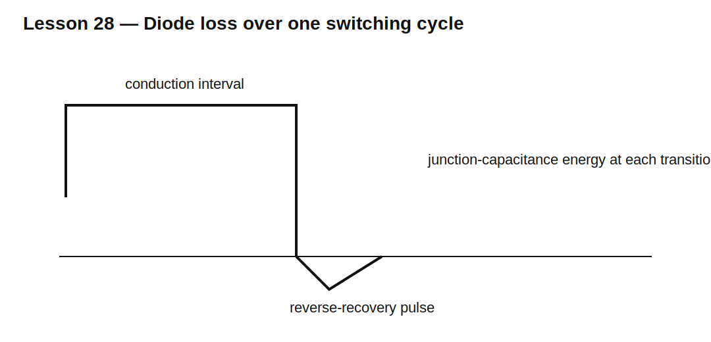

# Lesson 28 — Diode Switching Loss in Converters

> **Fast-track time:** 15–20 minutes  
> **Capability unlocked:** Separate conduction, recovery, and capacitive diode losses in a switching converter.

## Loss categories

### Conduction loss

$$P_{cond}=\frac{1}{T}\int_0^T v_D(t)i_D(t)dt$$

A first estimate is:

$$P_{cond}\approx V_FI_{AVG}$$

### Reverse-recovery loss

When the opposite switch turns on, it may supply diode recovery current. A useful estimate is:

$$E_{rr}\sim V_{BUS}Q_{rr}$$

$$P_{rr}=E_{rr}f_s$$

### Junction-capacitance loss

Charging and discharging diode capacitance costs energy even for Schottky and SiC devices:

$$E_C=\int_0^{V_{BUS}}C_J(v)v\,dv$$

For constant C, this becomes approximately:

$$E_C=\frac12CV^2$$

## Where the heat appears

Not all recovery energy is dissipated in the diode. Part may be lost in the commutating MOSFET, wiring resistance, snubber, or resonant elements. Measure both devices when building a power-loss budget.

## KiCad experiment

Use a buck commutation cell with a 100 V bus, 2 A inductor current, and 100 kHz switching. Compare:

- ideal diode;
- PN diode with $Q_{rr}$;
- Schottky-like model;
- added junction capacitance.

Measure average diode power and switch turn-on energy.

## What to observe

- Conduction loss dominates at low frequency.
- Recovery loss grows approximately with switching frequency and bus voltage.
- Capacitive loss remains when minority-carrier recovery is absent.
- Ringing can redistribute energy without eliminating it.

## Design workflow

1. Draw diode current and voltage over one cycle.
2. integrate conduction energy;
3. estimate or simulate $Q_{rr}$ energy;
4. include capacitance energy;
5. multiply per-cycle energy by frequency;
6. calculate junction temperature;
7. verify with deskewed hardware measurements.

## Common mistakes

- Adding $V_FI$ and calling the loss complete.
- Assigning all recovery loss to the diode.
- Using typical $Q_{rr}$ at unrelated conditions.
- Ignoring output capacitance of SiC or Schottky devices.

## Design challenge

A diode conducts 3 A for 40% of each cycle with 0.9 V forward drop. It has 120 nC recovered charge at a 200 V bus and operates at 150 kHz.

Estimate conduction and recovery-related power, then state what additional loss terms remain.