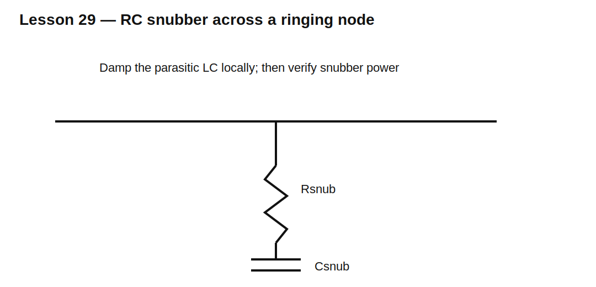

# Lesson 29 — Snubbers for Diode Recovery and Commutation Ringing

> **Fast-track time:** 15–20 minutes  
> **Capability unlocked:** Identify a parasitic LC mode and design an RC snubber that reduces overshoot without wasting excessive power.

## Why ringing appears

After diode recovery, current changes rapidly through stray inductance. That inductance resonates with diode, switch, and layout capacitance.

Approximate resonance:

$$f_r=\frac{1}{2\pi\sqrt{L_PC_P}}$$

## What an RC snubber does

A series RC placed across the ringing node provides a lossy path near resonance.

Starting estimates:

$$R_{snub}\approx\sqrt{\frac{L_P}{C_{eq}}}$$

Choose $C_{snub}$ comparable to or somewhat larger than the effective parasitic capacitance, then tune from measurement.

## Experimental capacitance method

1. Measure ringing frequency with no added capacitor.
2. Add a known capacitor across the node.
3. Measure the new frequency.
4. Solve for parasitic C and L.
5. Choose snubber C and damping R.

This is often more reliable than guessing layout inductance.

## Snubber loss

A capacitor charged and discharged each cycle dissipates approximately:

$$P_{snub}\approx C_{snub}V^2f_s$$

The exact factor depends on topology and waveform. Check resistor pulse and average power.

## KiCad experiment

Use 50 nH stray inductance and 100 pF node capacitance after a hard current interruption. Compare:

- no snubber;
- 220 pF with 22 Ω;
- 1 nF with 22 Ω;
- 1 nF with 100 Ω.

Measure overshoot, ringing decay, and snubber energy.

## What to observe

- Too little C barely changes the mode.
- Too much C lowers frequency and raises loss.
- Too little R underdamps; too much R barely absorbs energy.
- Placement matters because inductance outside the snubber loop remains unsnubbed.

## Common mistakes

- Adding a capacitor without a resistor and creating a new resonance.
- Choosing values from frequency alone without power analysis.
- Placing the snubber far from the switch and diode.
- Hiding a probe artifact rather than fixing the real circuit.

## Design challenge

A switch node rings at 45 MHz. Adding 220 pF changes the ringing to 30 MHz.

Estimate the original parasitic capacitance and inductance, then propose a starting RC snubber and estimate loss at 100 V and 200 kHz.