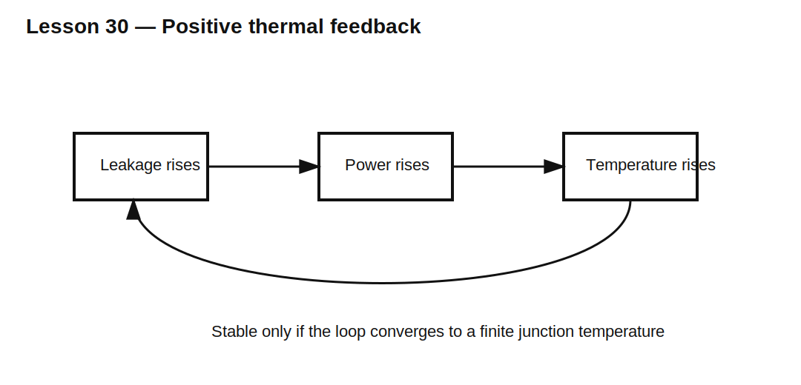

# Lesson 30 — Temperature, Leakage, and Thermal-Runaway Risks

> **Fast-track time:** 15–20 minutes  
> **Capability unlocked:** Recognize positive thermal feedback in diodes and prove that leakage and dissipation remain stable at high temperature.

## Temperature changes diode behavior

At a given forward current, silicon diode forward voltage usually falls as junction temperature rises. Reverse leakage usually rises strongly with temperature.

For reverse-biased devices:

$$P_{leak}=V_RI_R(T)$$

That power raises junction temperature:

$$T_J=T_A+P\theta_{JA}$$

If higher temperature causes enough additional leakage, the loop can become unstable.

## Schottky concern

Silicon Schottky diodes can have especially high hot leakage. At high reverse voltage and temperature, leakage dissipation may compete with or exceed conduction loss.

## Current sharing

Parallel diodes do not automatically share current. Forward-voltage temperature coefficient, series resistance, package coupling, and device matching determine whether one device hogs current.

Ballast resistance can improve sharing:

$$\Delta I\approx\frac{\Delta V_F}{R_{ballast}}$$

## Thermal iteration

A practical calculation is iterative:

1. estimate loss at ambient;
2. calculate junction temperature;
3. update forward voltage and leakage at that temperature;
4. recalculate loss;
5. repeat until temperature converges or diverges.

## KiCad experiment

Model a 40 V Schottky diode reverse-biased at 30 V with temperature-dependent leakage and a thermal RC. Compare ambient temperatures of 25°C, 75°C, and 125°C.

Then compare one diode with two parallel diodes, with and without 100 mΩ ballast resistors.

## What to observe

- Reverse leakage can dominate at hot temperature.
- Lower forward drop does not guarantee lower total loss.
- Parallel devices may share poorly without resistance.
- Thermal equilibrium may disappear beyond a certain ambient or reverse voltage.

## Common mistakes

- Using room-temperature leakage in a hot design.
- Calculating junction temperature only from forward conduction.
- Assuming identical parallel diodes share equally.
- Ignoring thermal coupling between nearby devices.
- Treating maximum junction temperature as a normal operating point.

## Design challenge

A 60 V Schottky diode sees 48 V reverse bias for 70% of each cycle. Its leakage is 0.2 mA at 25°C and 20 mA at 125°C. Package thermal resistance is 35°C/W and ambient is 85°C.

Estimate leakage power at both temperatures and determine whether a stable operating point appears plausible before adding conduction loss.