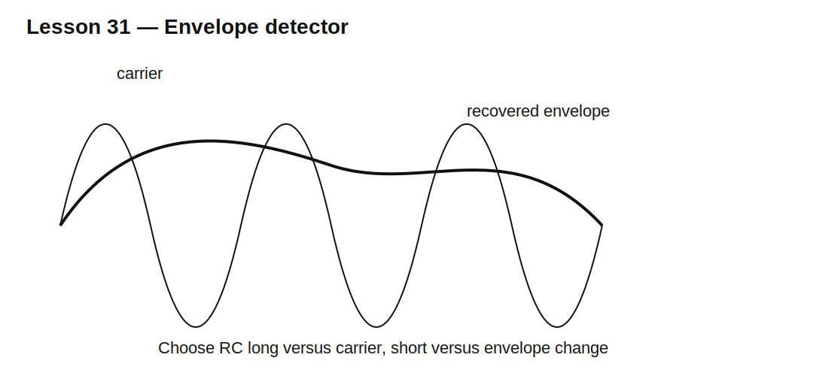

# Lesson 31 — Diode Envelope Detectors

> **Fast-track time:** 15–20 minutes  
> **Capability unlocked:** Recover a slowly varying amplitude envelope from a higher-frequency carrier.

## The basic detector

A diode charges a capacitor near carrier peaks. A resistor discharges the capacitor between peaks, allowing the output to follow the envelope.



## Time-constant tradeoff

The RC time constant must be:

- long compared with the carrier period;
- short compared with envelope changes.

A useful design condition is:

$$T_{carrier}\ll RC\ll T_{envelope}$$

If RC is too small, carrier ripple remains. If RC is too large, the detector cannot follow falling envelope amplitude and produces diagonal clipping.

## Diode threshold

For small signals, diode forward drop causes severe error. Options include:

- Schottky diode;
- biasing near conduction;
- precision rectifier;
- active detector;
- higher carrier amplitude.

## Source and load effects

The source must supply charging pulses. Load resistance is part of the discharge path. Probe resistance and capacitance can change detector behavior.

## KiCad experiment

Use a 100 kHz carrier amplitude-modulated by a 1 kHz sine. Compare RC values:

- 1 kΩ and 1 nF;
- 10 kΩ and 10 nF;
- 100 kΩ and 10 nF.

```spice
.tran 20n 5m startup
```

Plot input, rectified node, and recovered envelope.

## What to observe

- Small RC leaves carrier ripple.
- Large RC misses rapid downward envelope changes.
- Diode drop compresses low-amplitude portions.
- Source resistance limits peak charging current.

## Common mistakes

- Choosing RC only from the carrier frequency.
- Ignoring the maximum envelope slope.
- Assuming the output equals the true envelope at low amplitude.
- Forgetting load and probe resistance.

## Design challenge

Detect a 200 kHz AM carrier whose envelope contains audio up to 5 kHz. Carrier amplitude varies from 0.2–2 V peak.

Choose an initial RC range, diode type, and explain whether a passive detector can meet 20 mV low-level accuracy.