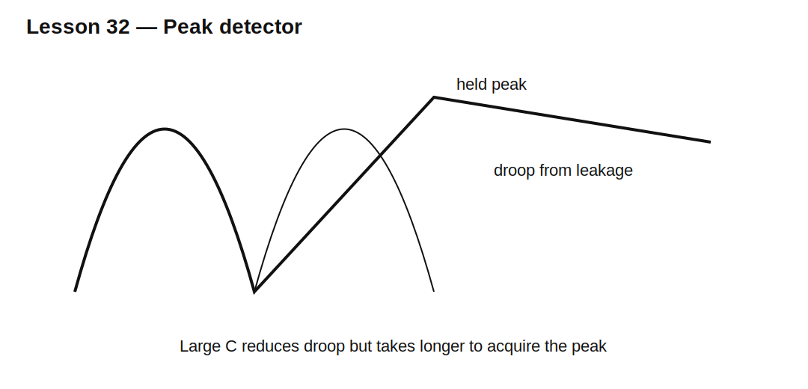

# Lesson 32 — Peak Detectors, Droop, and Reset

> **Fast-track time:** 15–20 minutes  
> **Capability unlocked:** Capture a waveform peak and predict hold error from diode drop, leakage, load, and acquisition time.

## Basic action

A diode charges a hold capacitor when the input exceeds the stored output by the diode forward voltage. When the input falls, the diode opens and the capacitor holds the peak.

## Droop

If total discharge current is approximately constant:

$$\Delta V=\frac{I_{leak}\Delta t}{C}$$

With an equivalent resistance:

$$V(t)=V_0e^{-t/(R_{eq}C)}$$

Leakage includes:

- diode reverse leakage;
- capacitor leakage;
- amplifier input current;
- reset-switch leakage;
- PCB contamination;
- probe loading.

## Acquisition error

The capacitor must charge through source resistance and diode resistance during the available peak interval. A very large hold capacitor reduces droop but may fail to acquire a short pulse.

## Active peak detector

Placing the diode inside an op-amp feedback loop reduces forward-drop error, but offset, bandwidth, slew rate, saturation recovery, and switch charge injection remain.

## Reset path

A practical detector needs a defined reset or discharge mechanism. The reset switch introduces on-resistance, off leakage, parasitic capacitance, and charge injection.

## KiCad experiment

Capture a 2 V, 10 µs pulse using 10 nF, 100 nF, and 1 µF capacitors. Add 10 nA leakage and compare passive versus idealized active detection.

Measure acquisition error after the pulse and droop after 100 ms.

## What to observe

- Larger C reduces droop but increases acquisition time.
- Schottky drop is lower but leakage may be higher.
- Short pulses may not fully charge the capacitor.
- Reset switching can disturb the held voltage.

## Common mistakes

- Selecting C only from droop.
- Ignoring source resistance and pulse width.
- Omitting reset behavior.
- Assuming an active detector has zero error.

## Design challenge

Capture a 0–3 V pulse lasting at least 5 µs. Acquisition error must be below 20 mV and droop below 5 mV over 50 ms. Total hold-node leakage may reach 20 nA.

Choose a minimum capacitor from droop, then determine the maximum charging resistance that satisfies acquisition.