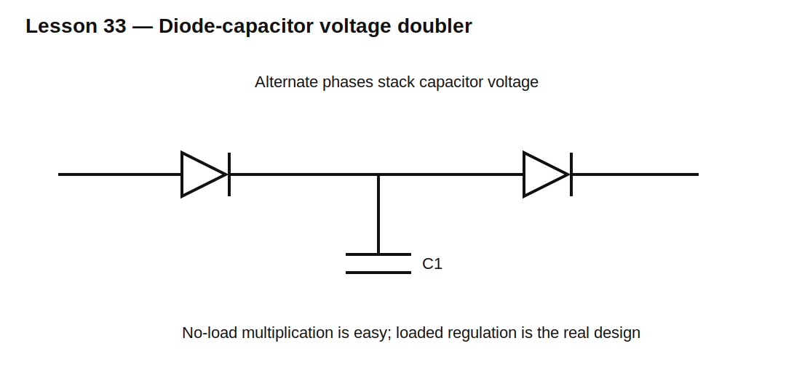

# Lesson 33 — Voltage Multipliers and Diode Charge Pumps

> **Fast-track time:** 15–20 minutes  
> **Capability unlocked:** Build higher or inverted voltages from switched capacitors and predict load-dependent sag and ripple.

## How charge pumping works

Diodes steer capacitor charging during alternate waveform phases. Capacitor voltages then add to or subtract from the source.

Common forms:

- voltage doubler;
- inverting charge pump;
- Cockcroft–Walton multiplier;
- diode-capacitor level shifter.

## Ideal no-load voltage

A simple doubler can approach:

$$V_{OUT}\approx2V_{PK}-2V_F$$

Real output is lower because of load current, capacitor ripple, source resistance, diode drop, and switching frequency.

## Charge balance

Each cycle transfers charge:

$$\Delta Q=C\Delta V$$

If load current is $I_L$ and refresh frequency is f:

$$\Delta V\approx\frac{I_L}{fC}$$

Multi-stage multipliers accumulate larger sag and output resistance.

## Equivalent output resistance

A charge pump can often be approximated as an ideal voltage source plus effective output resistance. That resistance depends on topology, capacitance, frequency, diode resistance, and number of stages.

## KiCad experiment

Use a 5 V peak, 10 kHz square wave with:

- half-wave doubler;
- inverting charge pump;
- three-stage multiplier.

Compare 10 nF, 100 nF, and 1 µF capacitors under 100 kΩ and 10 kΩ loads.

## What to observe

- No-load voltage can look impressive while loaded voltage collapses.
- Larger C and higher frequency reduce sag.
- Startup takes multiple cycles.
- Diode drop is especially important at low voltage.
- Every capacitor may need a different voltage rating.

## Common mistakes

- Quoting ideal multiplied voltage under load.
- Ignoring capacitor polarity and stage voltage.
- Assuming every stage delivers equal current capability.
- Forgetting startup inrush and diode peak current.

## Design challenge

Generate approximately −5 V at 5 mA from a 0–5 V, 100 kHz clock. Allow 0.5 V ripple and 0.5 V total diode/conduction loss.

Choose a topology and starting capacitor value, then estimate output resistance and startup time.