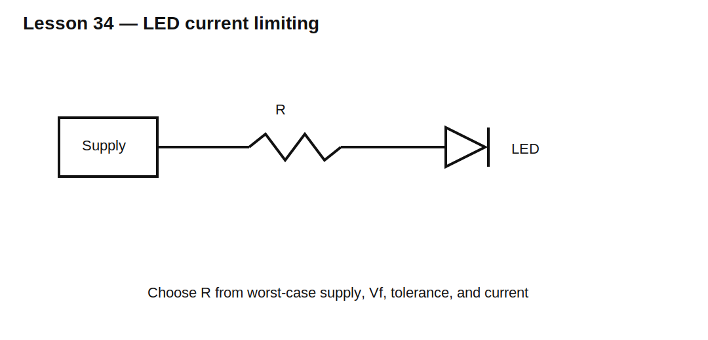

# Lesson 34 — LED Electrical Design and Current Limiting

> **Fast-track time:** 15–20 minutes  
> **Capability unlocked:** Set LED current safely across supply, forward-voltage, tolerance, and temperature variation.

## LED current must be controlled

An LED is a diode whose current rises steeply with voltage. Do not connect it directly across an ideal voltage source.

For a series resistor:

$$R=\frac{V_S-V_F}{I_{LED}}$$

## Design from corners

Maximum current occurs with:

- maximum supply voltage;
- minimum LED forward voltage;
- minimum resistor value.

$$I_{max}=\frac{V_{S,max}-V_{F,min}}{R_{min}}$$

Minimum current occurs at the opposite corner.

## Power

Resistor:

$$P_R=I^2R$$

LED:

$$P_{LED}=V_FI$$

Electrical power is not equal to optical power; much becomes heat.

## Multiple LEDs

### Series

The same current flows through all LEDs. Supply voltage must exceed the sum of forward voltages plus headroom.

### Parallel

Separate current-limiting resistors are usually required. LEDs do not share current reliably from one common resistor because their forward voltages differ and change with temperature.

## PWM dimming

PWM controls average light by changing duty cycle while keeping peak LED current controlled.

$$I_{AVG}=DI_{PK}$$

Check pulse-current rating, driver current, flicker, camera artifacts, and switching loss.

## KiCad experiment

Use a 5 V source, LED model, and resistor values 100 Ω, 220 Ω, and 470 Ω. Sweep supply 4.5–5.5 V and temperature 0–80°C.

Then compare two LEDs in parallel with one resistor versus separate resistors.

## What to observe

- LED voltage changes less than current.
- Supply tolerance significantly changes resistor-set current.
- Parallel LEDs can share poorly.
- PWM changes average current but not uncontrolled peak current.

## Common mistakes

- Treating LED forward voltage as exact.
- Choosing a resistor only from nominal values.
- Using one resistor for unmatched parallel LEDs.
- Exceeding driver-pin current or total MCU current.
- Assuming brightness is linear with current over every range.

## Design challenge

Drive a green LED from a 3.0–3.6 V rail at nominal 8 mA. LED forward voltage may be 1.9–2.4 V, and use a ±5% E24 resistor.

Choose the resistor and calculate minimum and maximum current and resistor power.