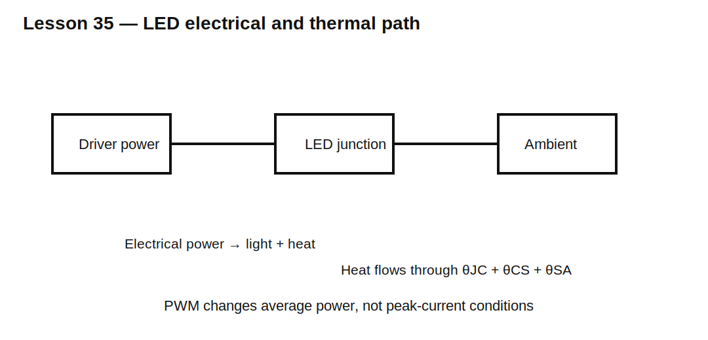

# Lesson 35 — LED Efficiency, Thermal Behavior, and PWM Dimming

> **Fast-track time:** 15–20 minutes  
> **Capability unlocked:** Design an LED path from optical target, electrical efficiency, thermal limits, and dimming behavior.

## Electrical versus optical power

Electrical input:

$$P_{elec}=V_FI_F$$

Only part becomes light. The rest becomes heat. Luminous efficacy, radiant efficiency, color, current, and junction temperature all affect the result.

## Junction temperature

Approximate:

$$T_J=T_A+P_{heat}\theta_{JA}$$

For power LEDs, use the full thermal chain:

$$T_J=T_A+P(\theta_{JC}+\theta_{CS}+\theta_{SA})$$

As temperature rises:

- forward voltage usually falls;
- light output may fall;
- color may shift;
- lifetime falls;
- leakage and driver stress can change.

## Resistor versus constant-current driver

A resistor is simple but wastes voltage:

$$\eta_{path}\approx\frac{V_F}{V_S}$$

A switching constant-current driver is usually better for high power or wide supply range. A linear current regulator improves current accuracy but still dissipates:

$$P_{driver}=(V_S-V_F)I$$

## PWM dimming

PWM maintains approximately constant peak current and changes average optical output using duty cycle.

Check:

- LED pulse-current rating;
- driver rise/fall time;
- minimum pulse width;
- PWM frequency;
- flicker and camera banding;
- thermal response;
- color stability.

## Analog dimming

Changing current can be quieter and avoids PWM artifacts, but color and efficacy may shift. Many systems combine coarse analog current control with PWM.

## KiCad experiment

Model a 3 V LED at 350 mA from a 12 V source using:

1. series resistor;
2. ideal linear current regulator;
3. ideal 90% efficient buck driver.

Compare electrical loss and junction temperature at 25°C and 60°C ambient. Then apply 10%, 50%, and 100% PWM duty.

## What to observe

- A resistor wastes most power when supply greatly exceeds LED voltage.
- PWM reduces average power but peak electrical and optical conditions remain.
- Junction temperature changes slowly compared with PWM periods.
- Hot LEDs may produce less light despite lower forward voltage.

## Common mistakes

- Rating the LED only from average current.
- Ignoring driver loss and heatsink interface.
- Assuming 50% PWM always produces exactly 50% perceived brightness.
- Choosing PWM frequency without considering cameras or audible components.
- Using maximum junction temperature as a design target.

## Design challenge

Drive a 3.0–3.4 V, 1 W white LED from 12 V with 350 mA peak current and 20–100% dimming. Compare resistor, linear, and buck-current-driver efficiency and estimate required thermal resistance for 60°C ambient with $T_J<110°C$.