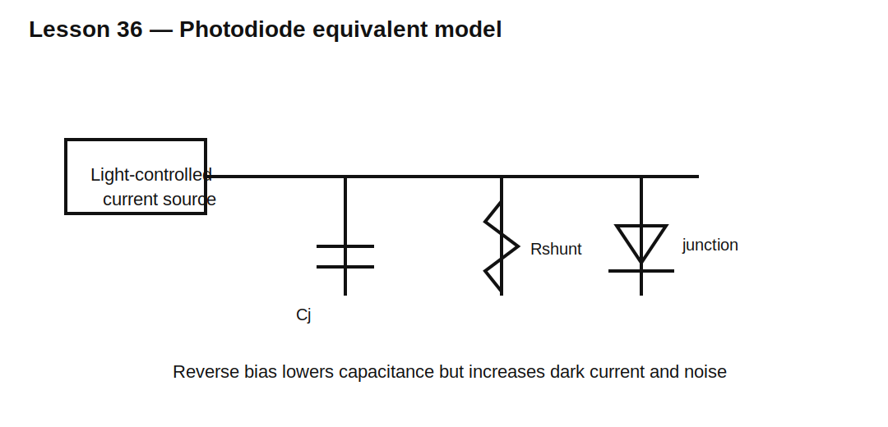

# Lesson 36 — Photodiodes: Current Source, Capacitance, and Bias

> **Fast-track time:** 15–20 minutes  
> **Capability unlocked:** Model a photodiode correctly and choose between photovoltaic and reverse-biased operation.

## The useful model

A photodiode is best thought of as a light-controlled current source in parallel with:

- junction capacitance;
- dark-current leakage;
- shunt resistance;
- package and wiring parasitics.



Photocurrent is approximately:

$$I_{PH}=R_{\lambda}P_{OPT}$$

where $R_{\lambda}$ is responsivity in A/W at the wavelength of interest.

## Photovoltaic mode

With little or no reverse bias:

- dark current is low;
- noise can be low;
- linearity is good;
- junction capacitance is relatively high;
- speed is lower.

This is useful for precision, low-frequency sensing.

## Photoconductive mode

Reverse bias widens the depletion region:

- junction capacitance decreases;
- bandwidth increases;
- dark current increases;
- shot noise increases;
- reverse-voltage and safety margins must be checked.

## Bandwidth from capacitance

A photodiode connected to resistance $R$ has a first-order bandwidth limit:

$$f_{-3dB}\approx\frac{1}{2\pi R(C_D+C_{IN}+C_{PAR})}$$

A large resistor gives more voltage per ampere but reduces bandwidth.

## Noise

Shot-noise current density is:

$$i_n=\sqrt{2qI\Delta f}$$

where $I$ includes photocurrent and dark current. Resistor thermal noise and amplifier noise can dominate depending on signal level.

## KiCad/ngspice experiment

Model a 50 µA pulsed photocurrent source in parallel with:

- 50 pF junction capacitance at 0 V bias;
- 10 pF at reverse bias;
- 100 MΩ shunt resistance;
- 1 nA dark current.

Compare a 100 kΩ load in both cases:

```spice
.tran 10n 200u startup
.ac dec 100 10 100Meg
```

## What to observe

- Output polarity follows current direction and load connection.
- Larger junction capacitance slows edges.
- Reverse bias improves bandwidth but raises dark current.
- The load resistor converts current into voltage but also forms the dominant RC pole.

## Design workflow

1. Define wavelength and minimum optical power.
2. obtain responsivity at that wavelength;
3. calculate photocurrent range;
4. choose photovoltaic or reverse-biased operation;
5. build a capacitance and leakage budget;
6. set bandwidth and noise targets;
7. decide whether a resistor load is sufficient or a transimpedance amplifier is required;
8. verify saturation and ambient-light range.

## Common mistakes

- Treating a photodiode as a light-dependent voltage source.
- Ignoring wavelength-dependent responsivity.
- Using nominal capacitance without bias conditions.
- Choosing a huge load resistor without checking bandwidth.
- Ignoring dark current at high temperature.

## Design challenge

A photodiode has 0.45 A/W responsivity at 850 nm, 20 pF capacitance at 5 V reverse bias, and 5 nA maximum dark current. Detect optical pulses from 1 µW to 100 µW with 100 kHz bandwidth.

Calculate the photocurrent range and determine whether a 100 kΩ resistor load can meet the bandwidth requirement before amplifier and stray capacitance are included.