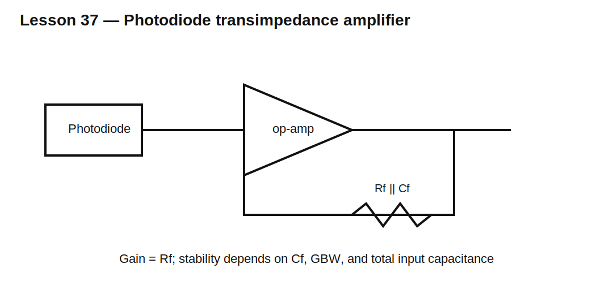

# Lesson 37 — Photodiode Transimpedance Interface Preview

> **Fast-track time:** 15–20 minutes  
> **Capability unlocked:** Convert photodiode current into a useful voltage while understanding gain, bandwidth, and stability tradeoffs.

## Why use a transimpedance amplifier

A resistor load converts current into voltage, but its resistance and photodiode capacitance create a bandwidth limit. A transimpedance amplifier (TIA) holds the photodiode node near a fixed voltage and converts current through a feedback resistor.

For an inverting TIA:

$$V_{OUT}\approx V_{REF}-I_{PH}R_F$$



## Virtual-ground advantage

Because the op-amp keeps its inverting input near the reference voltage:

- photodiode voltage changes little;
- capacitance is less directly charged by the signal current;
- linearity improves;
- higher transimpedance gain can coexist with useful bandwidth.

## Feedback capacitance

The photodiode, op-amp input, and layout capacitances create noise gain and phase shift. A feedback capacitor $C_F$ is often required for stability.

A first pole estimate is:

$$f_F=\frac{1}{2\pi R_FC_F}$$

But stable design also depends on op-amp gain-bandwidth and total input capacitance.

## Output range

The maximum current before saturation is approximately:

$$I_{MAX}\approx\frac{|V_{OUT,max}-V_{REF}|}{R_F}$$

Ambient light may consume more output range than the desired signal.

## Noise sources

Include:

- feedback-resistor thermal noise;
- op-amp input-current noise;
- op-amp voltage noise acting through input capacitance;
- photodiode shot noise;
- dark-current noise.

High gain does not automatically improve signal-to-noise ratio.

## KiCad/ngspice experiment

Use:

- pulsed current source: 0–10 µA;
- $C_D=30$ pF;
- $R_F=100$ kΩ;
- $C_F=2$ pF, 10 pF, and 47 pF;
- finite-gain op-amp model with 10 MHz GBW.

Run:

```spice
.tran 10n 200u startup
.ac dec 100 10 100Meg
```

## What to observe

- Too little $C_F$ produces overshoot or oscillation.
- Too much $C_F$ reduces bandwidth.
- Larger photodiode capacitance reduces phase margin.
- Output polarity is opposite to the photodiode current direction.
- Large ambient current can saturate the output even if the wanted pulse is small.

## Common mistakes

- Selecting $R_F$ only from desired gain.
- Ignoring total input capacitance.
- Using an ideal op-amp model.
- Forgetting output swing around the chosen reference.
- Placing the photodiode far from the amplifier input.

## Design challenge

Design a TIA for 0–20 µA signal current, 200 kHz bandwidth, 3.3 V single-supply operation, and a 1.65 V output reference. The photodiode plus input capacitance is 25 pF.

Choose a starting $R_F$, estimate the required output swing, and define the op-amp properties and feedback-capacitor tuning process.