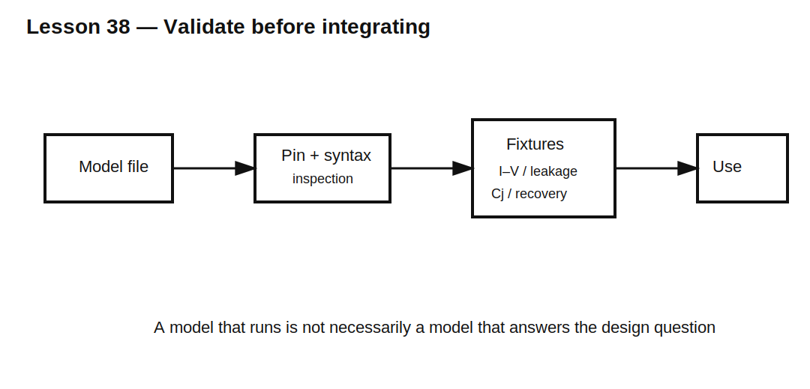

# Lesson 38 — Vendor Diode Models and Validation Fixtures

> **Fast-track time:** 15–20 minutes  
> **Capability unlocked:** Import a diode model, verify its pin mapping and behavior, and know which datasheet claims the model can reproduce.

## A model is not the datasheet

A vendor SPICE model may include some or all of:

- exponential forward conduction;
- series resistance;
- reverse breakdown;
- junction capacitance versus voltage;
- transit time and stored charge;
- temperature dependence;
- package parasitics;
- behavioral expressions.

It may omit surge limits, thermal damage, long-term reliability, avalanche limits, or realistic reverse recovery.



## Inspect before using

Check:

1. internal `.model` or `.subckt` name;
2. pin order and polarity;
3. simulator-specific syntax;
4. parameter units;
5. temperature assumptions;
6. whether the model is encrypted or simplified;
7. intended operating range.

## Build separate validation fixtures

### Forward I–V

```spice
.dc V1 0 1.5 1m
```

Compare forward voltage at several currents and temperatures.

### Reverse leakage and breakdown

Sweep reverse voltage only within safe model limits and compare leakage and breakdown current with datasheet conditions.

### Junction capacitance

Bias the diode in reverse and run small-signal AC analysis or inspect model capacitance parameters. Compare $C_J(V_R)$ with the datasheet curve.

### Reverse recovery

Use the controlled commutation fixture from Lesson 26. Match forward current, reverse voltage, $di/dt$, and temperature to the datasheet test.

## Model hierarchy

Use the simplest model that answers the question:

- constant drop for rough DC budgeting;
- exponential diode for bias and load-line work;
- capacitance-aware model for signal loading;
- charge-storage model for hard switching;
- vendor subcircuit for final comparison.

## KiCad workflow

1. Store the model file inside the project.
2. associate the symbol with the correct model name;
3. map anode and cathode pins explicitly;
4. inspect the generated netlist;
5. run the minimal validation fixture;
6. document any model changes or compatibility edits.

## What to observe

- A model can match forward voltage but have no realistic recovery.
- Typical curves are not guaranteed limits.
- Temperature settings can shift leakage by orders of magnitude.
- Wrong pin mapping may still produce plausible-looking but incorrect results.
- Convergence aids such as finite source rise time should represent physical behavior.

## Common mistakes

- Trusting a model because it loads without errors.
- Comparing simulation against a datasheet curve at different current or temperature.
- Assuming `Tt=0` is acceptable in a switching-loss study.
- Editing a vendor model without documenting the change.
- Treating simulation as a substitute for absolute-maximum ratings.

## Design challenge

Validate a candidate 60 V Schottky diode model for a 24 V, 5 A, 250 kHz converter.

Define fixtures and pass/fail comparisons for forward drop, hot reverse leakage, junction capacitance, surge relevance, and switching current. State which required design checks cannot be proven by SPICE alone.