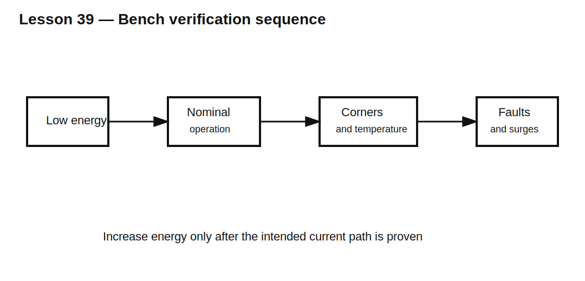

# Lesson 39 — Rectifier and Protection Bench-Verification Workflow

> **Fast-track time:** 15–20 minutes  
> **Capability unlocked:** Turn diode simulations into safe, repeatable hardware measurements with numerical pass/fail evidence.

## Verify one mechanism at a time

A complete diode-based power input may include rectification, reservoir capacitance, inrush limiting, reverse-polarity protection, TVS clamping, and filtering. Test each function separately before applying full fault energy.

## Define the exact stimulus

Document:

- source waveform and impedance;
- voltage tolerance;
- current limit;
- turn-on phase;
- pulse rise time and duration;
- repetition rate;
- ambient and component temperature.

A result is meaningful only when the hardware stimulus matches the calculation or simulation.

## Required measurements

For a rectified supply, capture:

- AC source voltage;
- bridge input current;
- reservoir-capacitor voltage;
- diode current or source current;
- load current;
- startup inrush;
- steady ripple;
- diode and capacitor temperature.

For protection, capture:

- protected-node voltage;
- clamp current;
- TVS voltage;
- path overshoot;
- fuse or limiter response;
- energy using deskewed voltage and current.

## Probe discipline

Fast clamp measurements require:

- short ground return or differential probe;
- sufficient bandwidth;
- known probe capacitance;
- voltage/current channel deskew;
- probe voltage and common-mode ratings;
- safe isolation practices.

The probe loop can create or exaggerate the spike being measured.

## Stepwise test plan

1. Verify polarity and DC continuity at low current.
2. apply reduced voltage with current limiting;
3. verify steady-state rectification and ripple;
4. measure startup with a smaller capacitor or lower voltage;
5. increase toward nominal energy;
6. inject controlled transients;
7. test high-line, low-line, light-load, and full-load corners;
8. repeat hot after thermal equilibrium;
9. compare against the same `.meas` metrics used in simulation.

## Useful pass/fail metrics

- maximum capacitor voltage;
- minimum loaded DC voltage;
- ripple peak-to-peak;
- peak and RMS source current;
- inrush $I^2t$;
- maximum protected-node voltage;
- clamp pulse energy;
- recovery current and ringing frequency;
- component temperature rise.

## Common mistakes

- Applying the full surge before validating current paths.
- Measuring only voltage and ignoring current/energy.
- Comparing cold simulation with hot hardware.
- Using a bench supply whose current limit changes the intended transient.
- Failing to record probe and fixture details.

## Design challenge

Write a bench-verification plan for a 12 V input protected by reverse-polarity MOSFET, 18 V TVS, 2 A fuse, bridge rectifier, and 2200 µF reservoir capacitor.

Include normal startup, reverse connection, 24 V overvoltage pulse, output short, and hot-restart tests with explicit pass/fail metrics and safe test sequencing.