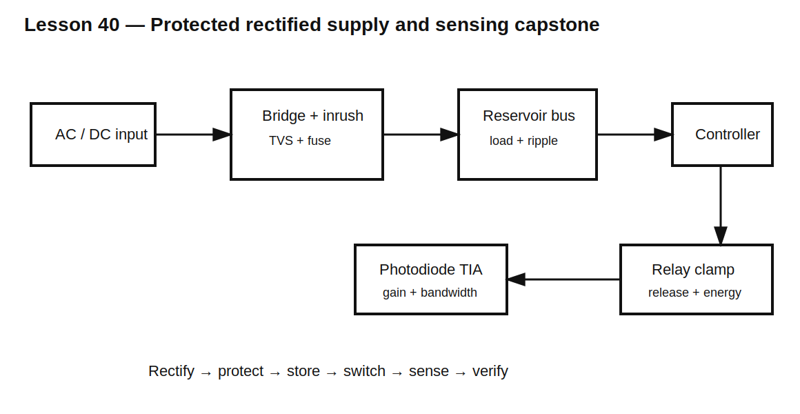

# Lesson 40 — Final Capstone: Protected Rectified Supply and Mixed-Signal Interface

> **Fast-track time:** 30–45 minutes  
> **Capability unlocked:** Integrate rectification, diode selection, clamping, reverse protection, sensing, thermal analysis, simulation, and bench verification.

## Design brief

Design a compact controller input stage powered from either:

- 12 V AC, 50/60 Hz; or
- 12–18 V DC of either polarity.

The board must produce an unregulated DC bus, protect downstream electronics, drive a relay, and sense an optical input.

## Requirements

### Power input

- AC input: 10–14 V RMS;
- DC input: 10–20 V, either polarity;
- load: 300 mA continuous;
- reservoir ripple: below 1.5 V peak-to-peak at 50 Hz;
- startup peak current: below 8 A;
- output capacitor voltage: below 25 V;
- reverse and connector miswiring must not damage the board.

### Transient protection

- external input may experience a 30 V, 10 ms pulse;
- downstream protected bus must remain below 24 V;
- surge current and TVS energy must be quantified;
- fuse or limiter coordination must be documented.

### Relay output

- coil: 12 V, 120 Ω, 60 mH;
- release current must fall below 10 mA within 4 ms;
- switching device must remain below 50 V;
- repetitive rate: 5 operations per second.

### Optical input

- photodiode responsivity: 0.5 A/W;
- optical range: 2–100 µW;
- required bandwidth: 50 kHz;
- single 3.3 V supply;
- output must not saturate under maximum light.

## Required design sections

### 1. Rectifier and reservoir

Calculate:

$$V_{PK}=\sqrt2V_{RMS}$$

$$C\ge\frac{I}{f_{ripple}\Delta V}$$

Then include:

- two bridge-diode drops;
- low-line and high-line transformer behavior;
- capacitor tolerance and ESR;
- diode peak and RMS current;
- source resistance and inrush;
- light-load capacitor voltage.

### 2. Input protection

Select:

- bridge or polarity-independent input arrangement;
- fuse or resettable limiter;
- TVS from actual clamp voltage at pulse current;
- intentional source impedance or precharge if needed.

Show the complete surge-current return path and include:

$$V_{protected}\approx V_C+L\frac{di}{dt}+IR$$

### 3. Relay clamp

Initial coil current:

$$I_0=\frac{12}{120}=100\text{ mA}$$

Stored energy:

$$E_L=\frac12(60\text{ mH})(0.1)^2=0.30\text{ mJ}$$

Choose a diode, Zener, or TVS clamp that meets both release-time and switch-voltage requirements. Include repetitive power and wiring overshoot.

### 4. Photodiode interface

Photocurrent range:

$$I_{PH}=R_{\lambda}P_{OPT}=1\text{ to }50\ \mu A$$

Choose a resistor load or TIA. Prove:

- output range remains inside the 3.3 V supply;
- 50 kHz bandwidth is met with total capacitance;
- dark current and noise are acceptable;
- ambient-light headroom exists.

### 5. Model validation

For each critical diode model, provide at least one fixture comparing simulation against a datasheet curve or table:

- bridge forward voltage;
- TVS clamp voltage;
- relay-clamp behavior;
- photodiode capacitance or responsivity model.

## Required simulations

1. AC bridge and reservoir startup;
2. steady ripple at 50 and 60 Hz;
3. high-line/light-load capacitor voltage;
4. worst-phase inrush;
5. 30 V transient and TVS current;
6. reverse or either-polarity DC input;
7. relay turn-off with clamp and layout inductance;
8. photodiode small-signal bandwidth;
9. photodiode maximum-light transient;
10. temperature corners for leakage and forward loss.

Every simulation must include numerical `.meas` results.

## Required design review

A reviewer must be able to answer:

- Where does current flow for each AC half-cycle?
- Which diode conducts during every normal and fault state?
- What limits startup and surge current?
- What is the actual capacitor voltage at high line and light load?
- Where is each stored joule dissipated?
- What is the worst hot leakage condition?
- Does the relay clamp release quickly enough without exceeding switch voltage?
- Does the optical interface meet both gain and bandwidth?
- Which results depend on model assumptions that require bench validation?

## Completion package

Submit:

- readable system and subsystem schematics;
- component calculations and ratings;
- KiCad/ngspice projects;
- diode-model validation fixtures;
- corner and temperature table;
- loss and thermal calculations;
- fault-current paths;
- bench-verification sequence;
- worked pass/fail table.

## Remember

> A production-quality diode design is not a collection of symbols. It is a controlled set of current paths for normal operation, startup, switching, overload, reverse polarity, transients, and measurement.